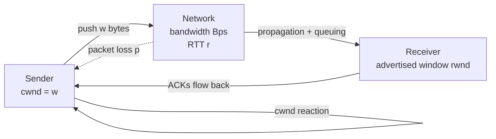

# Bandwidth vs Latency vs Throughput

## What it is
**Bandwidth** is the maximum data transfer capacity of a link or interface, measured in bits per second (e.g., 1 Gbps). **Latency** is the time delay between a request being initiated and the first byte of the response arriving, measured in seconds (commonly milliseconds for local, tens of ms for cross-region, hundreds of ms for intercontinental). **Throughput** is the actual rate of useful data delivered over time, measured in bits or bytes per second, bounded above by bandwidth and degraded by latency, packet loss, protocol overhead, and contention.

## Why it matters
Most "the network is slow" bugs are misclassified — the link has plenty of bandwidth but high tail latency, or throughput collapses because of TCP behavior under loss. Confusing the three leads to wrong fixes (upgrading bandwidth when latency is the bottleneck, or chasing throughput optimizations when the protocol overhead is the real cost).

## How it actually works

**Bandwidth** is a physical/link-layer property. On Ethernet it's defined by the PHY standard (10/100/1000/10000/40000/100000 Mbps). On a fiber link it's the line rate of the optical carrier. On a wireless link it's the channel capacity dictated by the modulation/coding scheme (MCS) under the current SNR — so wireless bandwidth is variable. Bandwidth is a theoretical ceiling, not a delivery promise. A 10 Gbps NIC still delivers less than 10 Gbps of useful payload because of:
- Inter-frame gaps (12 bytes minimum on Ethernet), preamble (7 bytes), SFD (1 byte)
- Frame headers (Ethernet 14+4 bytes, IP 20 bytes, TCP 20–60 bytes)
- TCP ACKs flowing in the reverse direction consuming capacity on the same link
- Retransmissions caused by loss

**Latency** has four additive components, often called the "four sources of latency":
1. **Propagation delay** — `distance / propagation_speed`. In fiber, light travels at roughly `2 × 10⁸ m/s` (about 2/3 of c due to refractive index ~1.5). So a transcontinental fiber route of ~6,000 km gives ≈ 30 ms one-way just from physics.
2. **Transmission delay** — `frame_size / bandwidth`. For a 1500-byte frame on 1 Gbps: 1500 × 8 / 10⁹ = 12 µs. Usually negligible vs propagation, dominates on very high-bandwidth long links only for small packets.
3. **Processing delay** — time each node spends inspecting headers, lookups (L2 CAM, L3 LPM, L4 port matching). Modern routers add single-digit µs; software stacks µs–ms.
4. **Queuing delay** — variable, depends on load and scheduler. Tail latency (e.g., p99) is dominated by queuing.

Latency is one-way (OWL — One-Way Latency) by definition, but most tools (ping, TCP RTT) measure **Round-Trip Time (RTT)**, which is `2 × OWL + server_processing_time`. Server processing time is often the largest component in modern web requests and is not part of network latency.

**Throughput** for a bulk transfer over a lossless network is bounded by the **bandwidth-delay product (BDP)**:

```
BDP (bits) = bandwidth (bps) × RTT (seconds)
```

This is the number of bits "in flight" — the amount of unacknowledged data the sender can push before it must stop and wait. On a 10 Gbps link with 100 ms RTT, BDP = 1,000,000,000 × 0.1 = **10⁸ bits = 12.5 MB**. That is how much data TCP needs to keep in flight to fully utilize the link. If the receiver's advertised window or the sender's congestion window is smaller than BDP, throughput is artificially capped at `window / RTT`.

**Why BDP matters for throughput** is the classic mistake people miss. Many "slow transfer" investigations chase bandwidth (e.g., upgrading from 1 Gbps to 10 Gbps), but if the kernel's TCP buffer (`net.ipv4.tcp_rmem`, `net.ipv4.tcp_wmem` on Linux) or the application's socket buffer (`SO_RCVBUF`, `SO_SNDBUF`) is not sized to BDP, the extra bandwidth is wasted. The formula for the minimum buffer to fill the pipe is `BDP / 8` bytes (convert bits to bytes), often with a safety margin to absorb jitter.

**TCP-specific behavior** further ties the three together:
- **Slow start**: `cwnd` (congestion window) starts at roughly `initcwnd` (RFC 6928 raised the initial window to ~10 MSS, about 15 KB in modern Linux). `cwnd` grows by ~1 MSS per ACK (effectively doubling per RTT) until `ssthresh` or loss.
- **Congestion avoidance**: after slow start, `cwnd` grows by 1 MSS per RTT (linear).
- **Loss reaction**: classic TCP (Tahoe/Reno) halves `cwnd` on loss; CUBIC (default in Linux since 2.6.19, RFC 8312) uses a cubic function of time since last loss and is much more aggressive on high-BDP links. **BBR** (Bottleneck Bandwidth and Round-trip propagation time, deployed in Google and Linux) estimates bottleneck bandwidth and RTT directly instead of inferring them from loss.
- **Throughput under loss**: Mathis et al. formula for TCP throughput in the classical Reno regime:

```
Throughput ≈ (MSS / RTT) × (1 / sqrt(p))
```

where `p` is the packet loss probability. This shows throughput falls steeply with even small loss — a 1% loss rate cuts classical TCP throughput dramatically; BBR is far less sensitive.

**Tools that measure each**:
- Bandwidth: `iperf3`, `netperf` — saturate the link and observe the achieved rate.
- Latency: `ping` (ICMP echo RTT), `mtr` (per-hop stats), `tcpping`, application-level probes. For one-way latency you need synchronized clocks (PTP, NTP) at both ends.
- Throughput: same as bandwidth tools, but interpreted as delivered useful bytes/sec, not link capacity.

**The bottleneck concept** is formalized by the **weakest link** in a path: the lowest-bandwidth segment, the highest-latency link, or the most contended queue. End-to-end metrics are determined by the minimum of capacity and the sum of delays across all segments. Note also that **bandwidth is additive across parallel paths but latency is not** — adding a second 1 Gbps link via LACP gives 2 Gbps of bandwidth, but RTT stays the same.

## Architecture / flow

A simplified feedback loop: sender's congestion window pushes bytes into the network, ACKs return, sender adjusts `cwnd` based on whether the network signaled loss or kept up.

## Key terms
- **BDP (bandwidth-delay product)** — bits of data that fit in the network pipe; minimum buffer size to fully utilize a link.
- **RTT** — round-trip time; the time between sending a packet and receiving its acknowledgment.
- **cwnd / rwnd** — TCP congestion window (sender-side, network-limited) and receiver window (receiver-side, buffer-limited). Effective in-flight data is `min(cwnd, rwnd)`.
- **Tail latency** — high-percentile latency (p95, p99, p99.9); usually dominated by queuing, GC pauses, or scheduler jitter rather than steady-state latency.
- **Jitter** — variance of latency over time; matters for real-time protocols (VoIP, gaming) where packets must arrive on schedule.
- **Goodput** — useful application-layer throughput, excluding protocol overhead and retransmissions; usually the number users actually care about.

## Example
```bash
# Saturate a 10 Gbps link and observe throughput vs RTT effect
iperf3 -c 10.0.0.1 -t 30 -P 4     # 4 parallel streams, default ~1MB TCP buffer
# Now enlarge the socket buffer to BDP for RTT=100ms, BDP=125MB:
iperf3 -c 10.0.0.1 -t 30 -P 4 -w 128M
# Compare reported sender/receiver throughput — the second run should be ~10x higher
# on long-fat pipes, illustrating the BDP-buffer bottleneck.
```

## Common mistakes
- **Confusing bandwidth with throughput.** A 1 Gbps link delivering 200 Mbps of HTTPS traffic has 5x overhead from headers, TLS records, ACKs, and retransmissions — not a "broken" link.
- **Reporting p50 latency as "the latency."** Tail latency (p99, p99.9) is what breaks user-facing systems; mean and median hide it.
- **Forgetting the BDP when tuning.** Raising `tcp_wmem`/`tcp_rmem` (Linux) or `SO_SNDBUF`/`SO_RCVBUF` (app) is mandatory when moving to high-bandwidth or high-RTT links; leaving defaults of ~64 KB–4 MB caps throughput regardless of link speed.
- **Ignoring server processing time.** A 5 ms RTT to a server that takes 800 ms to render is a backend problem, not a network problem — measuring only network latency gives a false picture.

## Lesser-known internals
- **Tail latency is rarely network-only.** On a healthy, uncongested link, p99 latency is almost always dominated by application pauses: GC stops (JVM default GC pauses, Python reference counting, Go stop-the-world phases), kernel scheduling (cgroup throttling, cfs_quota), NUMA remote-memory accesses, or lock contention. Network tails matter mostly when the link is saturated or has a lossy path.
- **Bandwidth asymmetry on the same path.** Many access links (DOCSIS, GPON, LTE) have download/upload ratios of 10:1 or more. ACK packets travel back on the slow upstream, and once they saturate it, **ACK compression and delay** cap the downstream throughput — sometimes to far below the nominal download rate. This is why tuning `tcp_ack` heuristics and enabling `TCP_DEFER_ACCEPT`/`TCP_QUICKACK` can matter.
- **Latency is not the same as "ping time" in TCP.** TCP's retransmission timer is based on smoothed RTT (`SRTT`) and RTT variance (`RTTVAR`) per RFC 6298, with a minimum RTO (retransmission timeout) of 1 second by default (Linux `tcp_rto_min`). On a quiet long-lived connection, a single dropped packet can stall the whole stream for ≥ 1 s, which appears as a latency spike even though the link is healthy.

## Topics to explore further
- **TCP congestion control variants** — CUBIC, BBR, BBRv2, DCTCP (data center TCP), and how each interprets bandwidth and latency differently.
- **QUIC and HTTP/3** — moves transport into user space, eliminates head-of-line blocking, and changes how latency interacts with throughput for multiplexed streams.
- **Tail-latency engineering** — hedged requests, request budgeting, load shedding, admission control (e.g., CoDel, FQ-CoDel queue management).
- **Bandwidth shaping and QoS** — token bucket, leaky bucket, WFQ, fq_codel, and how traffic engineering on a shared link trades latency for fairness.

## Learn next
- **TCP congestion control (CUBIC/BBR)** — directly extends how bandwidth and latency govern throughput under loss.
- **Bandwidth-delay product and buffer sizing** — the operational follow-up: how to actually configure your system for high-BDP links.
- **Tail latency and percentile SLAs** — natural next step once you can distinguish latency from throughput.