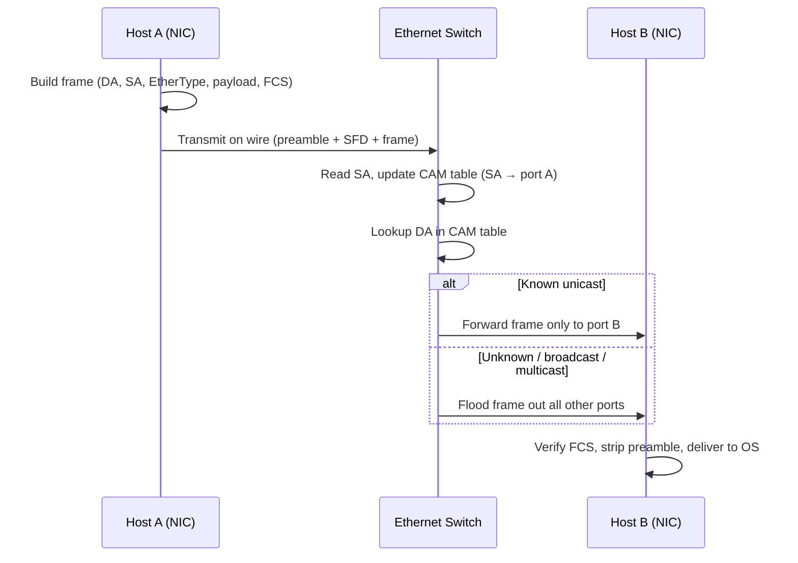

# Ethernet Protocol

## What it is
Ethernet is a family of wired LAN networking protocols standardized as IEEE 802.3 that define frame formats, MAC addressing, and the physical/media access rules for transmitting variable-sized packets over shared and switched electrical or optical media. The current standard family spans 10 Mb/s through 400 Gb/s link speeds, with `48-bit` MAC addresses and `1500-byte` default payload.

## Why it matters
Every TCP/IP packet, ARP request, and DHCP exchange a developer sees on a local network is encapsulated in an Ethernet frame; understanding the frame layout, MTU, and switch behavior is essential for debugging latency, jumbo frames, VLANs, and NIC offloads.

## How it actually works

### Frame structure (IEEE 802.3)
The classic Ethernet II / 802.3 frame is a contiguous byte sequence with this exact layout:

| Field | Size (bytes) | Purpose |
|---|---|---|
| Preamble | `7` | `10101010` × 7 — clock synchronization |
| SFD (Start Frame Delimiter) | `1` | `10101011` — marks frame start |
| Destination MAC | `6` | `48-bit` receiver address |
| Source MAC | `6` | `48-bit` sender address |
| EtherType / Length | `2` | `≥ 1536 (0x0600)` = EtherType (protocol ID); `≤ 1500` = 802.3 length |
| Payload | `46`–`1500` | Data (L3 packet); padded to `≥ 46` bytes |
| FCS (Frame Check Sequence) | `4` | CRC-32 over all fields except preamble/SFD |
| Interpacket Gap | `12` | `96-bit` idle period between frames |

Total on-wire: `64`–`1518` bytes for untagged frames, `68`–`1522` with `802.1Q` VLAN tag (4 extra bytes: `0x8100` TPID + `2-byte` TCI with 12-bit VLAN ID + 3-bit PCP/DEI).

The minimum frame size of `64 bytes` (excluding preamble/SFD) exists specifically so that a collision can be detected by a sender before it finishes transmitting — see CSMA/CD below. The payload minimum of `46 bytes` is derived: `64` − (6+6+2+4) = `46`.

### MAC addressing
A MAC address is `48 bits`, written as six hex octets (`AA:BB:CC:DD:EE:FF`). The low-order bit of the first octet is the **I/G (Individual/Group)** flag — `0` = unicast, `1` = multicast. The second-lowest bit is the **U/L (Universal/Local)** flag — `0` = OUI assigned by IEEE, `1` = locally administered. The `FF:FF:FF:FF:FF:FF` broadcast address sets all bits, including I/G. NICs also accept frames addressed to any multicast group they have joined (e.g., IPv4 multicast maps to `01:00:5E:00:00:00` + low 23 bits of the group IP).

### CSMA/CD (half-duplex legacy)
Carrier Sense Multiple Access with Collision Detection was the original shared-medium access method on `10BASE5`, `10BASE2`, and early `10BASE-T` hubs:

1. **Carrier sense** — NIC listens; if the medium is idle for `96 bit times` (the interframe gap), it may transmit.
2. **Transmit and listen** — while transmitting, the NIC monitors for voltage/current anomalies indicating another station sent simultaneously.
3. **Collision detection** — on detecting a collision, the NIC transmits a `32-bit` jam signal to ensure all stations see it.
4. **Backoff** — both stations wait a random number of slot times (`512 bit times` at `10 Mb/s` = `51.2 µs`) chosen via truncated binary exponential backoff: after the `i`-th collision, pick `r` uniformly from `[0, 2^k − 1]` where `k = min(i, 10)`; after `16` collisions, the frame is dropped.
5. **Retry** — attempt retransmission up to `16` times.

CSMA/CD is **disabled** on full-duplex links (every modern switch port), because each direction has its own channel and collisions are physically impossible. Modern Ethernet is effectively point-to-point full-duplex.

### The 802.3 standard and physical layers
IEEE 802.3 defines a unified MAC and a large family of physical layer (PHY) clauses. Key encodings:

- **10BASE-T** — `10 Mb/s`, Manchester encoding, Cat3/5 UTP, 100m reach.
- **100BASE-TX** (`Fast Ethernet`) — `100 Mb/s`, 4B/5B + MLT-3, Cat5.
- **1000BASE-T** (`Gigabit`) — `1 Gb/s`, PAM-5 over 4 pairs, Cat5e/Cat6.
- **10GBASE-T** — `10 Gb/s`, PAM-16 (DSQ128) over Cat6a/Cat7, 55–100m.
- **100GBASE-** family — `100 Gb/s` using NRZ or PAM-4 on fiber (and later copper), with multiple lane variants like `100GBASE-SR4`, `100GBASE-LR4`, `100GBASE-CR4`.

Each PHY has a defined **bit error rate target of `10⁻¹²`** for fiber backbones and `10⁻¹⁰` for some copper variants, which informs FEC requirements.

### Flow control and PAUSE frames
For full-duplex links, 802.3x defines **PAUSE frames** (EtherType `0x8808`, opcode `0x0001`) carrying a `2-byte` `pause_time` in quanta (one quanta = `512 bit times` at the link speed). The receiving station sends `802.3x PAUSE` to ask the far end to stop for N quanta; symmetric PAUSE pauses both directions. Modern data centers largely replaced this with **Priority Flow Control (802.1Qbb)** which operates per-priority class (8 classes) and is lossless for FCoE/RoCE storage traffic.

### Auto-negotiation
Clause 28 / Clause 73 auto-negotiation uses **NLP (Normal Link Pulse)** sequences called **FLPs (Fast Link Pulses)** — 33 pulses in `16` link pulses, encoding a `16-bit` selector + technology ability word. Devices advertise their highest common speed and duplex; both sides pick the highest mutually supported mode. Auto-negotiation is mandatory for `100BASE-TX` and faster twisted-pair PHYs.

### Switching and learning
A modern Ethernet switch maintains a **MAC address table (CAM table)** mapping `MAC → port`. On boot this is empty; the switch floods unknown unicast frames out all ports except the ingress. When a frame arrives, the switch (1) records `source MAC → ingress port` with a timestamp, (2) looks up the destination MAC, (3) forwards only to the known port (or floods if unknown/broadcast/multicast). Entries age out after a configurable timeout (typically `300` seconds).

### Jumbo frames
Non-standard frames larger than the `1500-byte` standard MTU. Common maximum is **`9000 bytes`** payload (so total frame ≈ `9022` bytes with VLAN tag), used in storage (iSCSI, NFS) and HPC fabrics to reduce per-frame overhead. Both ends and every switch in the path must agree, or frames are silently dropped.

### Checksum (FCS)
The trailing `4-byte` FCS is a **CRC-32** with polynomial `0x04C11DB7` (the same one used in ITU-T V.42, MPEG-2, and Gzip's trailing CRC), computed over Destination MAC through Payload. Receivers verify the FCS and discard mismatched frames silently — a corrupted Ethernet frame never reaches the OS; this is why `tcpdump` won't show bad packets unless you capture raw.

## Architecture / flow



## Key terms
- **MTU** — Maximum Transmission Unit; the largest `payload` (L3 packet) that fits in a single frame. Default `1500` bytes; jumbo frames commonly `9000`.
- **EtherType** — A `2-byte` field identifying the L3 protocol encapsulated in the payload (e.g., `0x0800` IPv4, `0x86DD` IPv6, `0x0806` ARP).
- **PHY** — The physical layer device that handles encoding/decoding between digital MAC and analog electrical/optical signals.
- **FCS** — Frame Check Sequence; a `32-bit` CRC over the frame body used by the NIC to drop corrupted frames.
- **CAM table** — Content-Addressable Memory table inside a switch mapping learned MAC addresses to physical ports.
- **PAUSE frame** — An `802.3x` flow-control frame asking the sender to stop transmitting for N `512-bit` quanta.

## Example

A raw 802.3 frame capturing an IPv4 ARP request as seen on the wire (excluding preamble/SFD), showing the exact byte layout:

```text
ff ff ff ff ff ff   ← Destination MAC (broadcast)
00 1a 2b 3c 4d 5e   ← Source MAC
08 06               ← EtherType: ARP (0x0806)
00 01               ← Hardware type: Ethernet
08 00               ← Protocol type: IPv4
06                  ← Hardware size: 6
04                  ← Protocol size: 4
00 01               ← Opcode: request
00 1a 2b 3c 4d 5e   ← Sender MAC
c0 a8 01 0a         ← Sender IP (192.168.1.10)
00 00 00 00 00 00   ← Target MAC (unknown, filled with zeros)
c0 a8 01 14         ← Target IP (192.168.1.20)
[4-byte FCS appended]
```

Demonstrates how an Ethernet header wraps an L3 protocol identified by the `0x0806` EtherType.

## Common mistakes
- **Assuming `1500` is the hard MTU limit on modern NICs** — almost all current NICs and switches support `9000`-byte jumbo frames, but they're off by default and per-interface.
- **Forgetting the interframe gap when calculating wire utilization** — back-to-back frames are separated by `12 bytes` of idle, so `10 Gb/s` cannot deliver more than `(line rate) × (1500 / (1500 + 20)) ≈ 98.7%` payload throughput for `1500`-byte frames.
- **Confusing duplex mismatches with cable issues** — a hard-coded `100 Mb/s` full-duplex port connected to an auto-negotiating `1 Gb/s` switch typically ends up at `100 Mb/s` half-duplex with severe late collisions and CRC errors.
- **Treating FCS errors as "physical layer problems" only** — they also occur from NIC offload bugs (especially LRO/TSO) or MTU mismatches where a device sends giant frames that get truncated.

## Lesser-known internals
- **The preamble is stripped before the frame is handed to the OS**, so `tcpdump -e` shows `DA, SA, EtherType, payload, FCS` but never the preamble/SFD. The `96-bit` interframe gap is also not visible to software — it is a PHY-level idle pattern.
- **802.1Q VLAN tags change the effective MTU math**: a `1500`-byte IP packet inside an `802.1Q` frame is a `1518`-byte Ethernet frame, and switches enforce the `1522`-byte max tagged MTU. Trunk ports carrying QinQ (`802.1ad`) need `802.1Q` MTU of at least `1530` bytes — `MTU 1500` IP traffic on a QinQ trunk silently drops.
- **NICs offload frame construction**: with **TSO (TCP Segmentation Offload)** the kernel hands the NIC a single `64 KB` super-frame and the NIC chops it into `1500`-byte frames including correct IP/TCP checksums; `ethtool -k <iface>` shows `tcp-segmentation-offload: on`. This is why `tcpdump` running on the *sender* sees the giant pre-segmented frame, while captures downstream see real wire-sized frames.

## Topics to explore further
- **ARP (RFC 826)** — how `IPv4 ↔ MAC` resolution actually works and why gratuitous ARP is critical for failover.
- **802.1Q / VLAN tagging** — trunk/access ports, native VLAN PVID, and VLAN hopping attacks.
- **LLDP (802.1AB)** — Layer 2 neighbor discovery used by network management tools.
- **PFC / DCB (802.1Qbb, 802.1Qaz)** — lossless Ethernet priorities used in RoCE and FCoE fabrics.

## Learn next
- **ARP** — Direct neighbor protocol; resolving `IP → MAC` is the immediate Layer 2 partner to Ethernet addressing.
- **802.1Q VLANs** — Ethernet's standard tagging scheme, built directly on top of the frame format.
- **Spanning Tree Protocol (802.1D / 802.1w)** — How Layer 2 networks avoid loops while still using Ethernet switches.