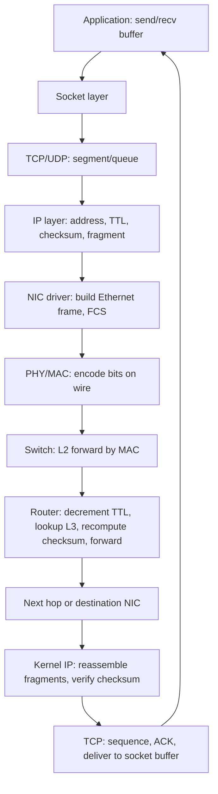

# How Data Travels — Packets

## What it is
A network packet is a unit of formatted data that traverses a packet-switched network, consisting of a structured header (control/metadata) and a payload (the carried data). Packets are the fundamental transfer unit used by IP-based protocols as defined in **RFC 791** (IPv4) and **RFC 8200** (IPv6), with link-layer framing defined by **IEEE 802.3** (Ethernet) and **IEEE 802.11** (Wi-Fi).

## Why it matters
Every API call, database query, service-to-service RPC, and TLS handshake is fragmented, addressed, and reassembled through packet machinery — understanding the structure determines how you debug latency, MTU issues, fragmentation, and connection failures.

## How it actually works

### The packet: header vs. payload
Every packet has two distinct regions:
- **Header** — control fields the network uses to deliver the packet (addresses, length, protocol type, checksum, flags).
- **Payload** (also called *body* or *data*) — the bytes being delivered, opaque to the routers in between.

The header is parsed at every hop that needs it; the payload is only inspected by the endpoints.

### IPv4 packet structure (RFC 791)
Total size: **20-byte fixed header** + options (0–40 bytes) + payload. Maximum total: **65,535 bytes** (16-bit Total Length field).

```
 0                   1                   2                   3
 0 1 2 3 4 5 6 7 8 9 0 1 2 3 4 5 6 7 8 9 0 1 2 3 4 5 6 7 8 9 0 1
+-+-+-+-+-+-+-+-+-+-+-+-+-+-+-+-+-+-+-+-+-+-+-+-+-+-+-+-+-+-+-+-+
|Version|  IHL  |    DSCP   |ECN|         Total Length          |
+-+-+-+-+-+-+-+-+-+-+-+-+-+-+-+-+-+-+-+-+-+-+-+-+-+-+-+-+-+-+-+-+
|         Identification        |Flags|    Fragment Offset      |
+-+-+-+-+-+-+-+-+-+-+-+-+-+-+-+-+-+-+-+-+-+-+-+-+-+-+-+-+-+-+-+-+
|  Time to Live |    Protocol   |         Header Checksum       |
+-+-+-+-+-+-+-+-+-+-+-+-+-+-+-+-+-+-+-+-+-+-+-+-+-+-+-+-+-+-+-+-+
|                       Source Address                          |
+-+-+-+-+-+-+-+-+-+-+-+-+-+-+-+-+-+-+-+-+-+-+-+-+-+-+-+-+-+-+-+-+
|                    Destination Address                        |
+-+-+-+-+-+-+-+-+-+-+-+-+-+-+-+-+-+-+-+-+-+-+-+-+-+-+-+-+-+-+-+-+
|                    Options                    |    Padding    |
+-+-+-+-+-+-+-+-+-+-+-+-+-+-+-+-+-+-+-+-+-+-+-+-+-+-+-+-+-+-+-+-+
|                             Payload                           |
+-+-+-+-+-+-+-+-+-+-+-+-+-+-+-+-+-+-+-+-+-+-+-+-+-+-+-+-+-+-+-+-+
```

Field-by-field:
- **Version** (4 bits) — `4` for IPv4.
- **IHL** (4 bits) — header length in **32-bit words**, minimum `5` (20 bytes), maximum `15` (60 bytes with options).
- **DSCP** (6 bits) — QoS class (RFC 2474).
- **ECN** (2 bits) — explicit congestion notification flags (RFC 3168).
- **Total Length** (16 bits) — header + payload, in bytes. Max 65,535.
- **Identification** (16 bits) — used to group fragments of one original datagram.
- **Flags** (3 bits) — bit 0 reserved (zero), **DF** (Don't Fragment) at bit 1, **MF** (More Fragments) at bit 2.
- **Fragment Offset** (13 bits) — offset of this fragment's payload in 8-byte units from the start of the original payload.
- **TTL** (8 bits) — decremented by 1 at each router hop; packet discarded when TTL reaches 0. Initial values: typically **64** (Linux/macOS), **128** (Windows).
- **Protocol** (8 bits) — next-header identifier. Common values: `1` ICMP, `6` TCP, `17` UDP, `41` IPv6 encapsulation, `58` ICMPv6.
- **Header Checksum** (16 bits) — one's complement sum of the header only; **recomputed at every hop** because TTL changes.
- **Source/Destination Address** (32 bits each).
- **Options** — rarely used (Record Route, Timestamp, Source Route). Most modern stacks ignore or strip them.

### IPv6 packet structure (RFC 8200)
**Fixed header: 40 bytes.** Total datagram max: **65,575 bytes** payload (with Jumbogram hop-by-hop option, up to ~4 GB). No header checksum (offloaded to link/upper layers); no fragmentation by routers (fragmentation is end-to-end only, via extension headers).

```
+-+-+-+-+-+-+-+-+-+-+-+-+-+-+-+-+-+-+-+-+-+-+-+-+-+-+-+-+-+-+-+-+
|Version| Traffic Class |           Flow Label                  |
+-+-+-+-+-+-+-+-+-+-+-+-+-+-+-+-+-+-+-+-+-+-+-+-+-+-+-+-+-+-+-+-+
|         Payload Length        |  Next Header  |   Hop Limit   |
+-+-+-+-+-+-+-+-+-+-+-+-+-+-+-+-+-+-+-+-+-+-+-+-+-+-+-+-+-+-+-+-+
|                                                               |
+                                                               +
|                                                               |
+                        Source Address                         |
|                                                               |
+                                                               +
|                                                               |
+-+-+-+-+-+-+-+-+-+-+-+-+-+-+-+-+-+-+-+-+-+-+-+-+-+-+-+-+-+-+-+-+
|                                                               |
+                                                               +
|                                                               |
|                     Destination Address                       |
|                                                               |
+                                                               +
|                                                               |
+-+-+-+-+-+-+-+-+-+-+-+-+-+-+-+-+-+-+-+-+-+-+-+-+-+-+-+-+-+-+-+-+
|                     Payload (variable)                        |
+-+-+-+-+-+-+-+-+-+-+-+-+-+-+-+-+-+-+-+-+-+-+-+-+-+-+-+-+-+-+-+-+
```

Field highlights:
- **Version** = `6`.
- **Traffic Class** (8 bits) — DSCP + ECN.
- **Flow Label** (20 bits) — identifies a flow for QoS treatment.
- **Payload Length** (16 bits) — payload only (not header).
- **Next Header** (8 bits) — either next extension header (`0` Hop-by-Hop, `43` Routing, `44` Fragment, `50` ESP, `51` AH, `60` Destination) or upper-layer protocol (same numbers as IPv4 Protocol).
- **Hop Limit** (8 bits) — equivalent of TTL.
- Addresses are **128 bits** (4× IPv4 size).

### Encapsulation
Packets are nested — each layer wraps the next:

```
Application data
  └─ wrapped by TCP header + payload → TCP segment
       └─ wrapped by IP header + payload → IP datagram / packet
            └─ wrapped by Ethernet header (14 B) + payload + FCS (4 B) → Ethernet frame
                 └─ encoded as bits on the wire (e.g., 8b/10b on 1G Ethernet, 64b/66b on 10G+)
```

Key facts:
- An **Ethernet frame** holds up to **1500 bytes** of payload (the IP MTU on most LANs), with header (14) + payload + FCS (4) for a total of **1518 bytes**, or **1522 bytes** with 802.1Q VLAN tagging.
- **MTU** (Maximum Transmission Unit) is the largest IP datagram that fits in a link-layer frame without fragmentation. Standard Ethernet MTU is **1500 bytes**.
- **Path MTU** is the smallest MTU along a route (RFC 1191); IPv6 mandates **PMTUD** (Path MTU Discovery, RFC 8201) and **no in-router fragmentation**.
- A typical TCP segment on the wire: **20-byte IP header + 20-byte TCP header + up to 1460 bytes of application data** = **1500-byte IP datagram**.

### Fragmentation
- IPv4: a router may fragment if a packet exceeds the outgoing link's MTU, unless the DF bit is set. Each fragment carries its own IP header; reassembly happens only at the destination (identified by source IP + Identification tuple). Overlapping fragments are dropped (RFC 5722).
- IPv6: only the source may fragment; routers drop and ICMPv6 Packet Too Big (`Type 2`) instead.

### Transmission sequence
1. Application calls `send()` / `write()` → kernel TCP/IP stack.
2. TCP segments the byte stream, attaches TCP header.
3. IP layer addresses it, sets TTL, computes checksum, fragments if needed.
4. NIC driver prepends Ethernet header, appends FCS (CRC-32), encodes bits (e.g., Manchester / 8b/10b / 64b/66b / PAM depending on speed).
5. Switches forward by MAC table; routers decrement TTL, recompute IP checksum, and forward to next hop.
6. Receiver NIC strips Ethernet framing, NIC DMA places frame into ring buffer (e.g., RX ring).
7. Kernel stack reassembles fragments if needed, verifies checksums (NIC offload often), and delivers payload to the socket's receive buffer.
8. Application calls `recv()` / `read()`.

### Performance-critical details
- **MTU mismatch** (e.g., VPN tunnel, IPsec, VXLAN) drops packets because of unexpected encapsulation — common PMTUD failure: ICMP Packet Too Big is blocked by firewalls, so senders never learn to shrink packets.
- **NIC offloads** — modern NICs handle checksum (LRO/LSO, TSO/UFO/GSO), segmentation (TSO), and even entire TCP reassembly (RPS/RSS). `ethtool -k` shows the state.
- **Jumbo frames** — MTU up to **9000 bytes**, common on datacenter storage networks; reduces per-packet overhead by ~6× for bulk transfers.
- **Interpacket gap** — Ethernet requires a minimum **96-bit (12-byte) idle period** between frames (IEEE 802.3 clause 4).
- **Minimum frame size** — Ethernet requires **64 bytes minimum** (excluding preamble/SFD), so payloads below 46 bytes are padded.

## Architecture / flow



## Key terms
- **MTU** — Maximum Transmission Unit; largest IP datagram that can traverse a link without fragmentation (1500 B on standard Ethernet).
- **TTL / Hop Limit** — 8-bit field decremented per hop; packet discarded at zero to prevent routing loops.
- **Encapsulation** — Each protocol layer wraps the previous layer's PDU as its payload; an Ethernet frame carries an IP packet, which carries a TCP segment.
- **Fragmentation** — Splitting a packet exceeding the outgoing MTU into smaller IP packets sharing an Identification value; reassembled only at the destination.
- **FCS (Frame Check Sequence)** — 32-bit CRC at the tail of every Ethernet frame for link-layer integrity.

## Example

A minimal raw IPv4 + UDP packet (DNS query for `example.com`) — illustrates the layered structure with exact sizes:

```text
Ethernet header (14 B):
  Dest MAC:  00:1a:2b:3c:4d:5e
  Src  MAC:  aa:bb:cc:dd:ee:ff
  EtherType: 0x0800 (IPv4)

IPv4 header (20 B):
  Version/IHL: 0x45    Total Length: 0x002c (44)
  ID:          0x1a2b  Flags/Offset: 0x4000 (DF set, offset 0)
  TTL:         0x40    Protocol: 0x11 (UDP)
  Checksum:    computed at send
  Src IP:      10.0.0.5
  Dst IP:      8.8.8.8

UDP header (8 B):
  Src Port: 0xc000 (49152)
  Dst Port: 0x0035 (53 — DNS)
  Length:   0x0008 + payload bytes
  Checksum: 0x0000 (optional for IPv4 UDP)

Payload: 12-byte DNS query (header + question section)
```

Demonstrates exact field widths, big-endian byte order, and that EtherType `0x0800` selects IPv4 while UDP port `53` is the IANA-assigned DNS service port.

## Common mistakes
- **Assuming MTU 1500 everywhere** — VPN tunnels (WireGuard adds 32 B, IPsec ESP adds 50–70 B), VXLAN (50 B), and GRE (24 B) shrink effective payload MTU; without PMTUD or MSS clamping (`iptables -A FORWARD -p tcp --tcp-flags SYN,RST SYN -j TCPMSS --clamp-mss-to-pmtu`), large sends hang or fragment.
- **Blocking all ICMP** — PMTUD depends on ICMP Type 3 Code 4 (IPv4) and ICMPv6 Type 2; firewalling these silently breaks large transfers.
- **Setting DF=0 to "allow" large packets** — with PMTUD broken, you get silent fragmentation or drops instead of errors, which is harder to debug than a clean failure.
- **Computing the IP checksum once** — it must be recomputed at every hop because TTL changes; offloading this to hardware is fine, doing it once and forgetting is a bug source in custom stacks.
- **Confusing payload MTU with MSS** — MSS is TCP-segment-only data (typically MTU − 40 for IPv4 or MTU − 60 for IPv6); TCP MSS clamping must subtract the right overhead.

## Lesser-known internals
- **IP Identification reuse** — IPv4's 16-bit ID field can wrap in high-throughput flows (e.g., 10 Gbps with 64 B packets = ~10⁵ pkt/s, wrapping ID in ~0.65 s). Modern stacks randomize ID per-datagram (RFC 6864 deprecated the old sequential scheme) and use IPID-for-ECN techniques to avoid overlap collisions across fragments.
- **The 12-byte IP header padding quirk** — IPv4 options are padded to a 4-byte boundary, but IHL counts 32-bit words, so an odd-length option field wastes up to 3 bytes and reduces effective payload.
- **IPv6 does not retransmit-fragment** — if one fragment of an IPv6 datagram is lost, the entire set must be retransmitted by the source; there's no per-fragment recovery, which is why TCP MSS clamping and PMTUD are mandatory rather than advisory.
- **NIC ring buffer overflow is a packet-level problem** — drops at `rx_queue_N_drop` (Linux `/sys/class/net/<iface>/statistics/`) are not visible to the application until the kernel backlog queue is also full — by then you've lost the early signal.

## Topics to explore further
- **TCP segment structure and state machine** — what sits inside IP packets for reliable streams.
- **PMTUD and MSS clamping** — how applications and middleboxes negotiate the real path MTU.
- **Jumbo frames and LRO/TSO offloads** — datacenter-scale packet mechanics.
- **QoS and DSCP/PCP mapping** — how packet headers drive scheduling decisions on switches and routers.

## Learn next
- **IP routing & longest-prefix match** — what routers actually do with the IP header once it arrives.
- **TCP segment & handshake** — the byte-stream protocol most apps build on top of IP.
- **Ethernet switching & VLANs** — the L2 layer that actually moves frames between hosts.