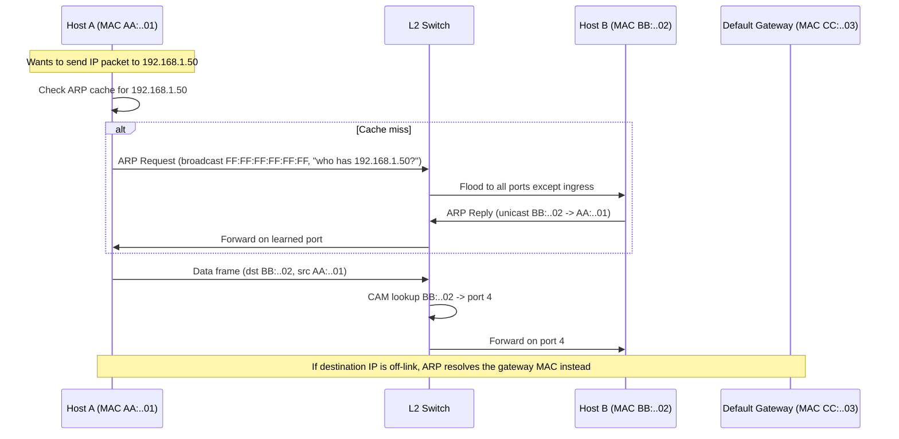

# MAC Addresses

## What it is
A Media Access Control (MAC) address is a 48-bit hardware identifier assigned to a network interface controller (NIC) for communications at the data link layer (Layer 2) of the OSI model. It is burned into the NIC's firmware by the manufacturer and is used as the source and destination address in Ethernet (IEEE 802.3) and Wi-Fi (IEEE 802.11) frames to identify endpoints on the same broadcast domain.

## Why it matters
MAC addresses are the actual mechanism by which frames are delivered to the correct device on a LAN. Understanding them is required to reason about ARP, switches' MAC learning tables, MAC address randomization, VLAN tagging, and the difference between L2 and L3 addressing.

## How it actually works

**Format and bit layout**

A MAC-48 (the canonical Ethernet form, defined in IEEE 802) is 48 bits, conventionally written as six pairs of hexadecimal digits separated by colons or hyphens:

```
AA:BB:CC:DD:EE:FF
```

Byte order on the wire is little-endian for the first three octets in some literature, but the canonical human-readable form is big-endian: the leftmost three octets are the OUI.

The 48 bits are split as:

| Bits | Field | Meaning |
|------|-------|---------|
| `bit 0` of first octet | **U/L** (Universal/Local) | 0 = universally administered (OUI-assigned), 1 = locally administered |
| `bit 1` of first octet | **I/G** (Individual/Group) | 0 = unicast, 1 = multicast |
| Bits 2–47 | OUI + NIC-specific | Assigned by manufacturer |

The I/G bit is the least significant bit of the most significant byte when read in the canonical representation. The broadcast address `FF:FF:FF:FF:FF:FF` has the I/G bit set and all other bits set, making it a group address with maximum reach within the broadcast domain.

**OUI (Organizationally Unique Identifier)**

The first 24 bits are the OUI, assigned by the IEEE Registration Authority to a manufacturer. The remaining 24 bits are the NIC-specific extension assigned by that manufacturer. With 24 bits of manufacturer space, each OUI holder can produce 2^24 (16,777,216) unique addresses before exhausting their block. To extend this, IEEE also issues **MA-S** (OUI-36, 28 bits of NIC space → 2^28 addresses), **MA-M** (OUI-28, 20 bits), and **MA-L** (OUI-24, 24 bits) blocks. The /28 smallest block still permits 2^20 = 1,048,576 devices, used for very high-volume producers like mobile chipset vendors.

A live OUI lookup is published by IEEE and is the authoritative source — vendors resell this data but IEEE assigns them.

**Address types**

- **Unicast (I/G = 0):** Identifies a single NIC. Frames addressed to a unicast MAC are delivered only to the matching interface.
- **Multicast (I/G = 1):** Identifies a logical group. The low 23 bits map to the low 23 bits of an IP multicast group address (for IPv4) — a fact codified in RFC 1112. IPv4 multicast MAC range: `01:00:5E:00:00:00` to `01:00:5E:7F:FF:FF` (23-bit overlap means 32 IP multicast groups map to the same MAC). IPv6 multicast uses `33:33:xx:xx:xx:xx` per RFC 2464.
- **Broadcast:** Special case `FF:FF:FF:FF:FF:FF`, flooded to every port on the L2 segment.

**Locally administered addresses (LAA)**

Setting the U/L bit to 1 marks the address as locally assigned. The range `00:00:00:00:00:00` is invalid for use. The range with U/L = 0 and the OUI portion zeroed but a non-zero NIC portion (e.g. `02:00:00:00:00:00`) is commonly used for virtual NICs (hypervisor-generated), container bridges, and random MAC features in iOS/Android.

The locally administered range commonly referenced is the full space with U/L=1: any address where the second-least-significant bit of the first octet is 1, i.e. addresses with the first octet being an even number plus 2 — concretely, the first hex digit is `2`, `6`, `A`, or `E` (because `0x02`, `0x06`, `0x0A`, `0x0E` have bit 1 set and bit 0 clear; the I/G bit remains 0 for unicast locally administered addresses). The full unicast LAA range is therefore any `x2:...`, `x6:...`, `xA:...`, `xE:...` where x is any hex digit and the I/G bit (bit 0) is 0.

**EUI-64 and 64-bit MACs**

IEEE has defined **EUI-64** (64-bit Extended Unique Identifier) for protocols like IPv6 interface identifiers and IEEE 1394 (FireWire). The conversion from EUI-48 to EUI-64 inserts `FF:FE` in the middle: `AA:BB:CC:DD:EE:FF` → `AA:BB:CC:FF:FE:DD:EE:FF`, then inverts the U/L bit when forming an IPv6 IID (RFC 4291 Appendix A). Bluetooth uses an entirely different 48-bit format (company-assigned blocks purchased from the IEEE Registration Authority, but unrelated to Ethernet OUIs and with a non-standard meaning of the U/L bit historically).

**How a NIC actually uses it**

When a frame is sent, the NIC's MAC engine:

1. Reads the destination MAC from the frame buffer.
2. Compares it against its own burned-in MAC (and any unicast/multicast filter list programmed by the driver).
3. If it matches, accepts the frame and raises an interrupt / DMAs it into host memory. Otherwise drops it in hardware.
4. The MAC is also written into the source address field on transmit.

Modern NICs support **MAC address filtering lists** (perfect-match unicast, multicast hash filtering using a 64-entry hash table computed from the CRC-32 of the destination address, and promiscuous mode which disables filtering entirely). Promiscous mode is what packet capture tools like `tcpdump` rely on; without it, the NIC silently drops frames not addressed to it or to an enabled multicast group.

**Switches and the CAM table**

Layer 2 switches maintain a **MAC address table** (Content Addressable Memory in hardware, or a software hash map) mapping `MAC → port`. When a frame arrives on a port, the switch records `(source MAC, ingress port)`. If the destination MAC is unknown, the switch **floods** the frame out all ports except the ingress one — this is "unknown unicast flooding." Once learned, subsequent frames are forwarded only to the known port. Entries age out after a configurable timer (commonly 300 seconds) if not refreshed.

**ARP and MAC/IP binding**

At Layer 2, hosts do not understand IP addresses. The **Address Resolution Protocol (RFC 826)** maps an IPv4 address to a MAC on the local segment: the host broadcasts an ARP request containing `"who has 192.168.1.1? tell 192.168.1.100"` with the sender's MAC, and the owner of that IP replies with its MAC in a unicast ARP reply. The result is cached in the ARP cache (entries expire, typically after 15–60 seconds on Windows, longer on Linux). IPv6 replaces this with **NDP (Neighbor Discovery Protocol, RFC 4861)** which uses ICMPv6 multicast instead of ARP broadcasts and includes DAD (Duplicate Address Detection) to verify uniqueness before assigning an address.

## Architecture / flow



## Key terms
- **OUI (Organizationally Unique Identifier)** — First 24 bits of a MAC, assigned by IEEE to identify the manufacturer.
- **U/L bit** — Bit 1 of the first octet; 0 = universally administered (factory), 1 = locally administered.
- **I/G bit** — Bit 0 of the first octet; 0 = individual (unicast), 1 = group (multicast/broadcast).
- **CAM table** — Switch's MAC-to-port mapping database, used for selective forwarding vs. flooding.
- **EUI-64** — 64-bit extended identifier; basis of IPv6 interface IDs, derived from 48-bit MACs via `FF:FE` insertion and U/L inversion.
- **Promiscuous mode** — NIC setting that disables destination-MAC filtering, required for packet sniffing.

## Example

```bash
# Inspect the MAC addresses on every interface on Linux.
# Note the U/L bit in the first octet: 02:.. = locally administered (virtual NIC),
# 0A:.. = locally administered (Docker bridge default), real hardware is usually
# a vendor OUI like 00:1A:2B (HP) or F0:18:98 (Apple).
ip link show

# Show the switch's learned MAC table (if running on a Linux bridge):
bridge fdb show

# Capture frames in promiscuous mode — note the destination MAC filter ignored.
sudo tcpdump -i eth0 -e -nn   # -e prints the L2 header including MACs
```

## Common mistakes
- **Assuming MACs are unique globally.** They are not — locally administered addresses, virtual NICs, and MAC spoofing (trivial: `ip link set dev eth0 address ...`) all break uniqueness. IEEE 802.1X and most L2 security cannot rely on MAC alone.
- **Reading the I/G bit the wrong way.** The broadcast address `FF:FF:FF:FF:FF:FF` has I/G=1, but so does any multicast. Confusing a multicast frame (delivered to a group) with a broadcast (delivered to everyone) leads to wrong assumptions about who receives the frame.
- **Forgetting that IPv4 multicast and MAC multicast don't map 1:1.** 32 IPv4 multicast groups collapse into the same MAC, so a NIC subscribed to one group receives traffic for 31 others. IPv6 multicast (`33:33:..`) maps 1:1, which is why IPv6 multicast is sometimes preferred in switched environments.
- **Treating the switch's MAC table as authoritative for security.** MAC flooding attacks overflow the CAM table, forcing the switch into fail-open hub mode where every frame is flooded — easily defeating L2 segmentation.

## Lesser-known internals
- **The `00:00:00:00:00:00` source MAC is invalid on the wire** — receivers and many stacks (Linux, Windows) drop such frames, and some drivers will not even transmit them. It appears in ARP request *padding* fields as a sentinel, not a real sender.
- **Multicast filtering uses a 64-bit hash of the CRC-32** of the destination MAC. With 23 bits of effective multicast address space and only 64 hash buckets, hash collisions cause unwanted multicast frames to be accepted; the driver must compensate with a software perfect-match filter on receive. This is why heavily subscribed multicast streams (e.g. financial market data) sometimes leak into unrelated VMs.
- **MAC address randomization is per-connection on iOS/Android** (rotates per Wi-Fi association since iOS 8 / Android 6, and per probe request since earlier) precisely because static MACs enable persistent tracking. The randomized address is a unicast LAA — the U/L bit set to 1 — and the OUI portion is typically `02:..` or similar.
- **Pause frames (IEEE 802.3x) use a reserved multicast destination** `01:80:C2:00:00:01` — the `01:80:C2:00:00:0x` block is reserved for L2 protocols and is not forwarded by bridges (the "reserved address" range).

## Topics to explore further
- **ARP spoofing and ARP cache poisoning** — the canonical L2 MITM; the basis of tools like `arpspoof` and `ettercap`.
- **IEEE 802.1Q VLAN tagging** — inserts a 4-byte tag including a 12-bit VLAN ID, changing the effective frame size from 1514 to 1522 bytes and the MAC learning model.
- **MACsec (IEEE 802.1AE)** — L2 encryption using MAC addresses as the identity for secure channel association.
- **Spanning Tree Protocol (IEEE 802.1D / 802.1w / 802.1s)** — uses special destination MACs `01:80:C2:00:00:00` (BPDUs) for loop prevention.

## Learn next
- **ARP (Address Resolution Protocol)** — the direct protocol that maps IPs to MACs on a LAN.
- **Ethernet frame structure (IEEE 802.3)** — where the MAC actually lives inside a frame, plus EtherType and payload.
- **L2 switching and STP** — how switches use MAC tables and avoid loops.