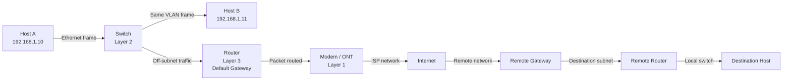

# Network Devices Overview

## What it is
Network devices are purpose-built hardware (or virtualized equivalents) operating at distinct layers of the OSI model, each performing a specific forwarding, segmentation, or translation function. The five foundational device types — **hub**, **bridge**, **switch**, **router**, and **gateway** — differ in which layer they operate at, what address information they inspect, and how they forward traffic.

## Why it matters
Every networked application a developer writes ultimately crosses multiple device types. Understanding where packets are broadcast, filtered, or routed determines why latency exists, why broadcasts storm, why VLANs work, and why a "router" in your home is actually several devices in one box.

## How it actually works

### Layer 1 — Hub
A **hub** is a physical-layer repeater. It has no intelligence beyond signal regeneration. When a frame arrives on any port, the hub repeats the electrical signal out every other port simultaneously. There is no MAC address table, no collision domain segmentation per port — all ports share **one collision domain and one broadcast domain**.

- Operates at **OSI Layer 1** (Physical).
- Repeats incoming bits to all other ports.
- Cannot filter, cannot learn MACs, cannot isolate traffic.
- Largely obsolete; replaced by switches even at the cheapest price points.

### Layer 2 — Bridge
A **bridge** connects two (or more) network segments and selectively forwards frames between them based on **MAC addresses**. It learns which MACs live on which side by inspecting source addresses of incoming frames, populating a MAC address table (also called a CAM table).

- Operates at **OSI Layer 2** (Data Link).
- Reduces collision domain size by separating segments.
- Forwarding decision uses destination MAC; unknown unicast is flooded.
- The conceptual ancestor of the modern switch. A bridge with multiple ports *is* effectively a multiport bridge, which is exactly what a switch is.

### Layer 2 — Switch
A **switch** is a multiport bridge. It maintains a **MAC address table** mapping MAC addresses to physical switch ports, populated dynamically through a learning process:

1. On frame arrival, the switch reads the **source MAC** and records it against the ingress port (with a timestamp/aging timer, typically **300 seconds** on Cisco defaults).
2. It looks up the **destination MAC** in the table.
3. Three outcomes:
   - **Known unicast**: frame forwarded only out the learned port.
   - **Unknown unicast**: frame flooded out all ports except the ingress port.
   - **Broadcast/multicast**: flooded out all ports except the ingress port (unless IGMP snooping or similar features are active).

- Operates at **OSI Layer 2** by default; **Layer 3 switches** add routing functionality (see below).
- Each switch port is its own **collision domain**; the entire switch is a single **broadcast domain** unless VLANs are configured.
- Forwarding is typically done in hardware via an **ASIC** (Application-Specific Integrated Circuit) for wire-speed performance.
- Common forwarding modes: **store-and-forward** (entire frame buffered, CRC checked before forwarding — adds latency but catches errors) and **cut-through** (begins forwarding as soon as destination MAC is read — lower latency but forwards corrupted frames). Modern switches often use **fragment-free** (a variant that waits for the first 64 bytes, the minimum Ethernet frame size, to catch most collisions) as a compromise.

### Layer 3 — Router
A **router** connects **different IP networks/subnets** and forwards packets based on **destination IP address** using a routing table.

- Operates at **OSI Layer 3** (Network).
- Maintains a **routing table** populated via static routes or dynamic routing protocols (OSPF, BGP, RIP, EIGRP).
- Each router interface is a separate **broadcast domain** and a separate **collision domain**.
- Performs **TTL decrement** on every forwarded packet; drops packets when TTL reaches 0 and sends an **ICMP Time Exceeded (type 11)** to the source.
- Performs **IP header checksum recalculation** since TTL changed.
- Performs **MTU handling**: if outbound interface MTU < packet size and the Don't Fragment (DF) bit is set, the router sends **ICMP Destination Unreachable (type 3, code 4) — "fragmentation needed and DF set"** back to the source. This is the basis of **Path MTU Discovery (PMTUD)**, defined in **RFC 1191**.
- Routers segment broadcast domains — broadcasts do not cross a routed boundary.

A **Layer 3 switch** is essentially a router implemented in switch hardware (ASIC-based forwarding) with high port density. It performs the same logical function as a router but is optimized for intra-datacenter or campus traffic.

### Layer 3+ — Gateway
A **gateway** is a device or software that translates between **different network protocols or architectures**. The term is overloaded:

1. **Default gateway**: the router IP address a host uses to send traffic destined for off-subnet destinations. The host's IP stack checks if the destination is in its own subnet; if not, it ARPs for the default gateway's MAC and sends the frame to it.
2. **Application gateway / protocol gateway**: translates between protocols — e.g., email gateway between X.400 and SMTP, VoIP gateway between SIP and PSTN, or an API gateway that translates between HTTP/REST and a backend protocol.

- Operates at any layer depending on function; can span OSI layers 4–7 when translating protocols.
- The default gateway is the most common meaning for developers.

### Modem
A **modem** (modulator-demodulator) converts digital data into a signal format suitable for the physical transmission medium — and vice versa. The modem is a **Layer 1 device** that adapts the digital interface (typically Ethernet) to the analog or carrier signal of the WAN medium.

- **DSL modem**: uses discrete multitone modulation over telephone lines; frequencies above ~4 kHz carry data.
- **Cable modem**: uses **DOCSIS** (Data Over Cable Service Interface Specification) over coaxial cable TV infrastructure, sharing bandwidth with other users in the segment (HFC — hybrid fiber-coax).
- **Fiber ONT/ONU**: technically a media converter rather than a "modem" in the traditional sense; converts optical signals to Ethernet.
- Modern home "modems" are often **gateway combos** that bundle a modem + router + switch + Wi-Fi AP + firewall in one physical device — which is why so many developers conflate these device types.

### Address types per device
| Device | Examines | Forwards based on | Learns |
|---|---|---|---|
| Hub | Nothing | N/A — repeats all | Nothing |
| Bridge | Destination MAC | MAC table | Source MAC → port |
| Switch | Destination MAC | MAC table | Source MAC → port |
| Router | Destination IP | Routing table | Routes via protocols |
| Gateway | Varies by purpose | Protocol translation rules | Varies |

## Architecture / flow


## Key terms
- **Collision domain** — A network segment where simultaneous transmissions collide; switches and routers isolate these per port/interface.
- **Broadcast domain** — The set of devices that receive a broadcast frame; routers break broadcast domains, switches do not (without VLANs).
- **CAM table** — Content-Addressable Memory table inside a switch; the MAC address → port mapping used for L2 forwarding.
- **MTU** — Maximum Transmission Unit; largest IP packet size (default **1500 bytes** for Ethernet) that can pass without fragmentation.
- **ICMP** — Internet Control Message Protocol; carries diagnostic messages like "destination unreachable" and "time exceeded."

## Example
A typical home gateway's logical topology, as you'd see it in the device's admin UI:

```text
WAN interface (modem) ──► Public IP assigned via DHCP/PPPoe
        │
        ▼
   Router (Layer 3) ── NAT, DHCP server, firewall
        │
        ▼
   Switch (Layer 2) ── Ports 1–4, internal VLAN 1 (192.168.1.0/24)
        │
        ├──► Wi-Fi AP (often bridged into same VLAN)
        │
        └──► Ethernet ports
```

This single box performs modem, router, switch, AP, and firewall functions — which is precisely why "router" in a consumer context usually means several devices running together.

## Common mistakes
- Calling a home gateway "the router" and assuming the Wi-Fi access point, switch, and modem are separate — they're not, but their failure modes are.
- Assuming switches eliminate broadcasts — they don't, only routers (or VLAN-interfaces / Layer 3 switches) do.
- Forgetting that the host itself makes the routing decision first: if the destination IP is on a different subnet, the host sends the frame to its **default gateway's MAC**, not to the destination host's MAC. The destination IP in the packet stays unchanged through the routed path; only Layer 2 addresses are rewritten hop-by-hop.
- Assuming all switches do Layer 3 — a basic "unmanaged switch" is pure Layer 2 and will drop routed traffic or ignore IP headers entirely.

## Lesser-known internals
- **Store-and-forward vs cut-through** is not just a latency choice — store-and-forward catches CRC errors and runts before they consume bandwidth, while cut-through can propagate a bad frame across many switches before the error is detected.
- **Switches and broadcast storms**: without **STP (Spanning Tree Protocol, IEEE 802.1D)** or its faster successor **RSTP (802.1w)**, redundant Layer 2 paths create forwarding loops where broadcasts multiply exponentially and saturate the network in seconds. This is why STP is enabled by default on managed switches.
- **Asymmetric routing** breaks stateful firewalls and some NAT setups: if traffic from host A to server S goes out one ISP link and the return traffic comes in another, the firewall may drop the reply because it never saw the original outbound packet on that interface.

## Topics to explore further
- **VLANs and 802.1Q tagging** — how switches partition broadcast domains with a 4-byte tag inserted into the Ethernet frame.
- **Spanning Tree Protocol variants** — MSTP (802.1s), PVST, and how loops are prevented.
- **NAT and PAT** — how a single public IP maps to many private IPs, and why it breaks protocols that embed addresses in payloads.
- **BGP and OSPF** — the dynamic routing protocols that populate routing tables at ISP and enterprise scale.

## Learn next
- **OSI and TCP/IP models** — the layered framework that defines what each device actually does. *Direct foundation for this topic.*
- **Ethernet framing and MAC addressing** — the exact byte layout switches parse. *Explains how a switch's CAM table works.*
- **IP addressing and subnetting** — required to understand router forwarding decisions. *Defines the router's forwarding logic.*