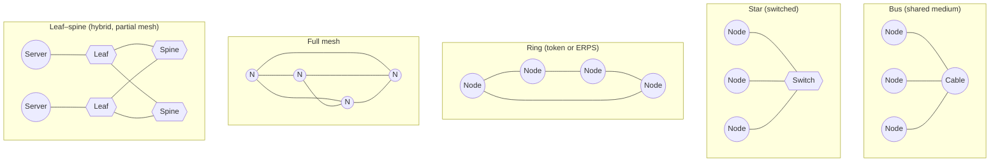

# Network Topologies

## What it is
A network topology is the arrangement of nodes and the logical or physical connections between them in a communication network, defined independently of physical cable runs (physical topology) and of the data paths actually used (logical/signal topology). It specifies how devices are linked, how traffic flows, and how failure or growth affects the network as a whole.

## Why it matters
Every application that touches the network — from a single-host socket to a globally distributed service — ultimately sits on a topology with concrete failure, latency, and scaling properties. Choosing or understanding the topology behind a LAN, a data center fabric, or a service-mesh overlay explains real behavior: why a single switch can take down a star, why loops require STP, why mesh links multiply, and why modern fabrics converge on leaf–spine.

## How it actually works

### Bus (linear bus, 10BASE5/10BASE2 era)
All nodes share a single shared medium. A transmitting node broadcasts onto the cable; every other node listens, and CSMA/CD (defined in IEEE 802.3) governs access. Because the medium is shared, only one station may transmit at a time, collisions occur, and the entire segment fails if the cable is broken or terminated incorrectly (50 Ω terminators required at both ends on 10BASE2 to prevent signal reflection). Scalability is poor: as nodes increase, collision domain utilization degrades, and the maximum segment length is bounded by the physical layer (500 m for 10BASE5 thick coax, 185 m for 10BASE2 thin coax). Repeaters can extend the bus but only one collision domain exists across the segment, and there is no inherent redundancy.

### Star
Every node connects to a central device — historically a hub, today almost always a managed or unmanaged switch. With a hub the star is logically a bus (hub repeats electrical signals on all ports, single collision domain per hub); with a switch the star becomes a switched network where each port is its own collision domain, full-duplex is possible, and CSMA/CD is effectively moot. Failure model: a single switch or one uplink becomes a single point of failure unless the switch is paired, stacked, or replaced with a dual-supervisor chassis. Star is the dominant LAN topology because it scales by upgrading the central device rather than rewiring and because each leaf link is independently diagnosable. Modern Ethernet (IEEE 802.3) is star-wired; the physical "star" runs to a switch, but multiple switches form larger structures (extended star, tree).

### Ring
Each node has exactly two neighbors, and frames travel around the ring in one direction (unidirectional) or both (bidirectional). The classic implementation is Token Ring (IEEE 802.5, largely historical) where a 3-byte *token* circulates; only the node holding the token may transmit, giving deterministic access with no collisions. The successor relevant today is the ring topology embedded in fiber and metro networks (FDDI, IEEE 802.5, Resilient Packet Ring IEEE 802.17) and in certain storage fabrics. Modern "ring" thinking survives in protocols that construct logical rings for fault isolation, e.g. Ethernet Ring Protection Switching (ERPS, ITU-T G.8032) achieving <50 ms failover. Failure handling requires a bypass mechanism (relay that shorts the node when powered off) or a dual counter-rotating ring (FDDI) so a single break can be healed by wrapping traffic back along the secondary ring.

### Mesh
Every node connects to multiple others. **Full mesh** of *n* nodes has `n(n−1)/2` links and *n−1* redundant paths per node; **partial mesh** connects only some pairs. Each additional link is an additional path, so failure of any single link is tolerated as long as the graph remains connected. Cost grows quadratically in full mesh, which is why partial mesh dominates: enough redundancy to meet availability targets without the link budget of full mesh. Routing protocols (OSPF, IS-IS, BGP) are designed to exploit multiple paths and recompute shortest-path trees in O(VE) time (Dijkstra) or O(VE log V) depending on implementation. Wireless mesh (IEEE 802.11s) and large ISP networks are partial mesh; data center *fabrics* are a structured partial mesh (see leaf–spine below).

### Tree (extended star) and hybrid
A tree is stars nested under other stars, joined by switches acting as distribution and core layers: access → distribution → core. It scales a star to building or campus size but inherits the single-point-of-failure characteristics at each tier unless redundancy is added. A *hybrid* mixes two or more of the above — the most common modern example is a **leaf–spine** data center fabric: every leaf switch connects to every spine switch (mesh between tiers), and every server connects to two leaves (dual-homing for redundancy). This gives exactly two equal-cost paths between any two servers and uniform, predictable latency of one leaf hop + one spine hop. Leaf–spine replaced the older three-tier access/aggregation/core design because east–west traffic now dominates over north–south in modern applications.

### Logical vs physical
The same network can simultaneously be physically a star and logically a mesh, or physically a bus and logically a ring. VLANs (IEEE 802.1Q) carve a switched star into multiple broadcast domains, each of which is logically its own star or extended star. Spanning Tree Protocol (STP, IEEE 802.1D) and its faster variants (RSTP 802.1w, MSTP 802.1s) build a loop-free *logical* tree on top of a *physical* mesh of switches by blocking redundant links until a primary path fails, then unblocking in <6 s (STP) or sub-second (RSTP).

### Performance and failure characteristics (summary table)
| Topology | Link cost for n nodes | Single-node failure | Single-link failure | Typical max nodes | Collision domain |
|---|---|---|---|---|---|
| Bus | n−1 on one segment | Takes down all | Takes down all | ~30 on 10BASE2 | One shared |
| Star (hub) | n | Hub SPOF | Isolated to leaf | Hub port count | One shared |
| Star (switch) | n | Switch SPOF unless redundant | Isolated to leaf | Switch port count | One per port (full-duplex) |
| Ring | n | Bypass/dual-ring heals | Heals via wrap or ERPS | Hundreds (FDDI) | One shared (token) |
| Full mesh | n(n−1)/2 | Tolerated | Tolerated | Small (cost) | None (switched) |
| Leaf–spine | L·S (leaves × spines) | Tolerated if dual-homed | Tolerated | Thousands | None (full-duplex) |

## Architecture / flow


## Key terms
- **Collision domain** — A set of nodes whose frames can collide on the medium; separated by switches or bridges, not by routers.
- **Broadcast domain** — A set of nodes reachable by a Layer-2 broadcast frame; bounded by routers and VLAN boundaries.
- **Single point of failure (SPOF)** — A component whose failure disconnects part or all of the network; minimized in mesh, concentrated in star/tree.
- **STP / RSTP** — Spanning Tree Protocol variants (802.1D / 802.1w) that prevent loops by blocking redundant links in a physically meshed, logically tree-shaped L2 network.
- **ECMP** — Equal-Cost Multi-Path routing; sends flows over multiple equal-cost next hops, the routing-layer analog of a topology's path redundancy.

## Example
A minimal leaf–spine topology expressed as a router-style config, showing how every leaf has a link to every spine:
```yaml
# Conceptual: 2 spines × 2 leaves leaf–spine fabric
spine1:
  links: [leaf1, leaf2]
spine2:
  links: [leaf1, leaf2]
leaf1:
  links: [spine1, spine2]
  hosts: [server1, server2]
leaf2:
  links: [spine1, spine2]
  hosts: [server3, server4]
# Result: 2 equal-cost paths between any two servers,
# max 2 switch hops end-to-end, full bisection bandwidth.
```

## Common mistakes
- **Assuming a "star" means no SPOF.** A single non-stacked, non-stacking switch is still one device; a single supervisor failure takes the whole star down. Mitigate with stacked switches, MC-LAG, or chassis with dual supervisors.
- **Forgetting that hubs make a physical star a logical bus.** Plugging a hub into a switch port does not give you per-port collision domains; the hub's ports all share one.
- **Believing full mesh is the most resilient.** For `n` nodes you pay `n(n−1)/2` links and `O(n²)` configuration; partial mesh (e.g. leaf–spine) gives the redundancy you actually need at a fraction of the cost.
- **Connecting switches in a loop without STP or a loop prevention protocol.** Switches flood unknown unicasts and broadcasts; a loop turns the broadcast domain into a *broadcast storm* that saturates links and CPU within seconds.

## Lesser-known internals
- A token ring is *not* a collision-prone medium. The token grants exclusive transmit rights, so there are no collisions by design — the opposite of the usual Ethernet/CSMA assumption.
- ERPS (G.8032) and many metro ring protocols achieve sub-50 ms failover by sending a single R-APS control frame around the ring; the time is bounded by ring propagation, not by protocol convergence, which is why carriers use rings for premium services.
- A leaf–spine built with sufficient spines gives **full bisection bandwidth** — the aggregate server-to-server capacity equals the aggregate server uplink capacity — which is why it replaced three-tier designs for east–west-heavy workloads.

## Topics to explore further
- **Spanning Tree Protocol internals** — BPDU format, root bridge election, port states, RSTP rapid transitions.
- **OSPF and IS-IS link-state convergence** — how routing protocols exploit the redundancy a mesh topology provides.
- **802.1Q VLANs and VXLAN overlays** — how a single physical topology is split into many logical topologies.
- **Optical ring protection and ERPS (G.8032)** — carrier-grade ring failover mechanics.

## Learn next
- **CSMA/CD (IEEE 802.3)** — the access method that makes bus and hub-star topologies work, and why switches made it obsolete.
- **Spanning Tree Protocol (802.1D/802.1w)** — the control plane that makes redundant switched topologies safe.
- **Leaf–spine fabric design** — the direct descendant of mesh topology theory in modern data centers.