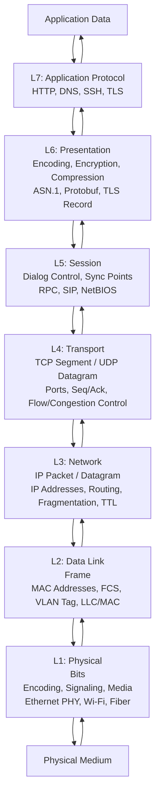

# OSI Model — Layer by Layer Deep Dive

## What it is
The OSI (Open Systems Interconnection) model is a 7-layer conceptual framework standardized in ISO/IEC 7498-1 that partitions network communication into distinct functional layers, each providing services to the layer above while relying on the layer below. Each layer encapsulates data from the layer above by adding its own header (and sometimes trailer), forming a Protocol Data Unit (PDU) specific to that layer.

## Why it matters
While modern networking primarily implements the TCP/IP model, the OSI model remains the universal vocabulary for network troubleshooting, protocol design, and cross-layer reasoning — every network engineer and systems developer maps real protocols to OSI layers to isolate failures, design interfaces, and reason about encapsulation boundaries.

## How it actually works

### Layer 1 — Physical
**PDU:** Bit  
**Function:** Transmission and reception of raw bit streams over a physical medium. Defines electrical, mechanical, procedural, and functional specifications for activating, maintaining, and deactivating physical links.  
**Key standards:** IEEE 802.3 (Ethernet PHY), ITU-T G.992.x (DSL), IEEE 802.11 (Wi-Fi PHY), USB 3.x, PCIe  
**Encoding schemes:** NRZ, NRZI, Manchester, 4B/5B, 8B/10B, 64B/66B, PAM4, OFDM  
**Measurable parameters:** Bit rate (bps), bandwidth (Hz), latency (propagation delay), BER (Bit Error Rate), signal-to-noise ratio (dB)  
**Devices:** Repeaters, hubs, media converters, transceivers (SFP/QSFP modules)  
**No addressing** — purely signal transmission.

### Layer 2 — Data Link
**PDU:** Frame  
**Function:** Node-to-node delivery, framing, physical addressing (MAC), error detection, flow control, and media access control. Divided into two sublayers per IEEE 802:
- **LLC (Logical Link Control, IEEE 802.2):** Multiplexes Layer 3 protocols via DSAP/SSAP or SNAP headers; provides optional flow control and error recovery.
- **MAC (Media Access Control):** Controls medium access (CSMA/CD for half-duplex Ethernet, CSMA/CA for Wi-Fi), frames data, adds MAC addresses (48-bit EUI-48 or 64-bit EUI-64), appends FCS (Frame Check Sequence, typically CRC-32 per IEEE 802.3).

**Key protocols/standards:**
- IEEE 802.3 (Ethernet) — Frame: Preamble (7B) + SFD (1B) + Dst MAC (6B) + Src MAC (6B) + EtherType/Length (2B) + Payload (46-1500B) + FCS (4B) + IFG (12B idle). MTU 1500B standard, 9000B jumbo.
- IEEE 802.11 (Wi-Fi) — Frame types: Management, Control, Data. Uses RTS/CTS, ACK, NAV for collision avoidance.
- IEEE 802.1Q (VLAN tagging) — 4-byte tag inserted after Src MAC: TPID (0x8100) + TCI (PCP 3b + DEI 1b + VLAN ID 12b).
- PPP (RFC 1661) — Point-to-point links, HDLC-like framing.
- ARP (RFC 826) — IPv4-to-MAC resolution, operates at L2/L3 boundary.

**Devices:** Switches (L2), bridges, NICs.  
**Addressing:** MAC addresses (OUI + device identifier). No routing — switching/forwarding via MAC learning tables (CAM).

### Layer 3 — Network
**PDU:** Packet (IP) / Datagram  
**Function:** End-to-end logical addressing, routing, fragmentation/reassembly, TTL/hop limit, QoS marking (DSCP/ECN), and path determination across heterogeneous networks.

**IPv4 (RFC 791, RFC 2474 for DSCP):**
- Header: 20-60 bytes (IHL 5-15 32-bit words). Fields: Version (4), IHL, DSCP (6b), ECN (2b), Total Length (16b), Identification (16b), Flags (3b: DF, MF), Fragment Offset (13b), TTL (8b), Protocol (8b: TCP=6, UDP=17, ICMP=1), Header Checksum (16b), Src/Dst IP (32b each), Options (variable).
- Fragmentation: DF=0 allows fragmentation; MF=1 more fragments; Offset in 8-byte units. Reassembly at destination only.
- TTL decremented per hop; 0 → ICMP Time Exceeded (Type 11, Code 0).

**IPv6 (RFC 8200):**
- Fixed 40-byte base header: Version (4), Traffic Class (8b: DSCP+ECN), Flow Label (20b), Payload Length (16b), Next Header (8b), Hop Limit (8b), Src/Dst IPv6 (128b each).
- No header checksum, no fragmentation in routers (only source via Path MTU Discovery, RFC 8201), no broadcast (uses multicast).
- Extension headers chain via Next Header: Hop-by-Hop, Routing, Fragment, AH, ESP, Destination Options, Mobility, etc.

**Routing protocols:**
- **OSPF (RFC 2328):** Link-state, Dijkstra SPF, areas, cost = 10^8 / bandwidth(bps). AD 110.
- **IS-IS (RFC 1195):** Link-state, TLV-based, CLNS/CLNP origin, used in ISP cores. AD 115.
- **BGP-4 (RFC 4271):** Path-vector, TCP/179, AS_PATH attribute, policy-driven. eBGP AD 20, iBGP AD 200.
- **RIPv2 (RFC 2453):** Distance-vector, hop count metric (max 15), UDP/520. AD 120.
- **EIGRP (Cisco proprietary, partial RFC 7868):** Hybrid, DUAL algorithm, composite metric (bandwidth, delay, load, reliability). AD 90 internal, 170 external.

**ICMP (RFC 792 IPv4, RFC 4443 IPv6):** Error reporting (Destination Unreachable, Time Exceeded, Parameter Problem) and diagnostics (Echo Request/Reply). Not a transport protocol — no ports.

**Devices:** Routers, L3 switches.  
**Addressing:** IPv4 (32-bit, dotted decimal), IPv6 (128-bit, hex colon). CIDR notation (e.g., 192.168.1.0/24). Subnet masks / prefix lengths.

### Layer 4 — Transport
**PDU:** Segment (TCP) / Datagram (UDP)  
**Function:** Process-to-process delivery via ports (16-bit), segmentation/reassembly, connection management, reliability, flow control, congestion control, multiplexing.

**TCP (RFC 793, RFC 5681, RFC 7323, RFC 8960):**
- Header: 20-60 bytes. Fields: Src/Dst Port (16b each), Sequence Number (32b), Acknowledgment Number (32b), Data Offset (4b), Reserved (3b), Flags (9b: NS, CWR, ECE, URG, ACK, PSH, RST, SYN, FIN), Window Size (16b, scaled via WS option), Checksum (16b, pseudo-header + segment), Urgent Pointer (16b), Options (variable: MSS, WS, SACK, Timestamps).
- **Connection establishment:** 3-way handshake: SYN (ISN) → SYN-ACK (ISN, ACK=ISN+1) → ACK (ACK=ISN+1). Simultaneous open possible (both send SYN).
- **Connection termination:** 4-way: FIN → ACK → FIN → ACK. TIME_WAIT (2*MSL, typically 60s) on active closer.
- **Reliability:** Cumulative ACKs, retransmission timeout (RTO) via Jacobson/Karels algorithm (RFC 6298), Fast Retransmit (3 dup ACKs), Fast Recovery, SACK (RFC 2018).
- **Flow control:** Sliding window, receiver-advertised rwnd. Zero window → persist timer.
- **Congestion control:** Slow Start (cwnd += 1 MSS per ACK), Congestion Avoidance (cwnd += 1 MSS per RTT), Fast Recovery. Variants: Reno, CUBIC (Linux default, RFC 8312), BBR (RFC 8982).
- **MSS:** Typically MTU - 40 (IPv4) or - 60 (IPv6). Negotiated in SYN.
- **Ports:** 0-65535. Well-known (0-1023), Registered (1024-49151), Ephemeral (49152-65535, RFC 6056).

**UDP (RFC 768):**
- Header: 8 bytes fixed. Src/Dst Port (16b each), Length (16b, header+data), Checksum (16b, optional in IPv4, mandatory in IPv6). No connection, no reliability, no ordering, no flow/congestion control.
- Used for: DNS (53), DHCP (67/68), NTP (123), SNMP (161/162), TFTP (69), QUIC (443/UDP), RTP, syslog (514).

**SCTP (RFC 4960):** Multi-homing, multi-streaming, message-oriented, 4-way handshake, cookie-based anti-DoS. Port 132 (SCTP), 5000 (SCTP over DTLS).

**DCCP (RFC 4340):** Datagram congestion control, unreliable but congestion-controlled. Used for streaming media.

**Devices:** Firewalls (stateful inspection), load balancers (L4), NAT gateways.

### Layer 5 — Session
**PDU:** Data  
**Function:** Dialog control, session establishment/maintenance/termination, synchronization (checkpointing), token management. Rarely implemented as a distinct protocol in modern stacks; functions absorbed into L4 (TCP connections) or L7 (application sessions).

**Protocols/standards:**
- **NetBIOS (RFC 1001/1002):** Session service over TCP/139, name service UDP/137, datagram UDP/138.
- **RPC (RFC 5531 / ONC RPC):** Session-like semantics via program/version/procedure numbers, TCP/UDP port 111 (portmapper).
- **PPTP (RFC 2637):** GRE (IP protocol 47) + TCP/1729 for control.
- **L2TP (RFC 3931):** UDP/1701, often over IPsec.
- **SIP (RFC 3261):** Application-layer session control (VoIP), uses SDP (RFC 4566) for media negotiation.

**Key concept:** Session ≠ Transport connection. One TCP connection can carry multiple logical sessions (HTTP/1.1 pipelining, HTTP/2 streams); one session can span multiple transport connections (FTP data/control, SIP re-INVITE).

### Layer 6 — Presentation
**PDU:** Data  
**Function:** Data representation, encoding, encryption, compression, serialization. Translates between application data formats and network byte order. In practice, implemented within L7 protocols or libraries.

**Standards/formats:**
- **ASN.1 (X.680/X.690):** Abstract Syntax Notation One. Encoding rules: BER (Basic), DER (Distinguished, deterministic), PER (Packed), OER (Octet). Used in X.509, SNMP, LDAP, Kerberos.
- **XDR (RFC 4506):** External Data Representation, used by ONC RPC, NFS.
- **Protobuf / Thrift / Avro / Cap'n Proto:** Modern serialization, schema-driven.
- **TLS 1.3 (RFC 8446):** Encryption, authentication, integrity at presentation/session boundary. Record layer: ContentType (1B), LegacyVersion (2B), Length (2B), Encrypted Fragment. Handshake: ClientHello, ServerHello, EncryptedExtensions, Certificate, CertificateVerify, Finished. 1-RTT handshake, 0-RTT resumption (PSK).
- **SSL/TLS compression:** DEFLATE (RFC 3749) — deprecated due to CRIME/BREACH attacks.
- **Character encoding:** UTF-8 (RFC 3629), ASCII, ISO-8859-1.
- **Compression:** gzip (RFC 1952), DEFLATE (RFC 1951), Brotli (RFC 7932), Zstandard (RFC 8878).

**Network byte order:** Big-endian (RFC 1700). `htonl()`, `htons()`, `ntohl()`, `ntohs()` for conversion.

### Layer 7 — Application
**PDU:** Data / Message  
**Function:** User-facing protocols, APIs, services. Highest layer; interacts directly with software applications.

**Key protocols (port/protocol):**
- **HTTP/1.1 (RFC 7230-7235):** TCP/80. Request/Response, headers, chunked transfer encoding, pipelining, persistent connections (Connection: keep-alive).
- **HTTP/2 (RFC 7540):** TCP/443 (h2) or TCP/80 (h2c). Binary framing, multiplexed streams, header compression (HPACK, RFC 7541), server push, stream prioritization.
- **HTTP/3 (RFC 9114):** QUIC (UDP/443). 0-RTT, stream multiplexing without head-of-line blocking, TLS 1.3 integrated. QPACK header compression (RFC 9204).
- **DNS (RFC 1035, RFC 7766):** UDP/53, TCP/53 (for >512B responses, AXFR). Message: Header (12B), Question, Answer, Authority, Additional. Resource Records: A, AAAA, CNAME, MX, NS, TXT, SOA, PTR, SRV, CAA, DNSKEY, DS. EDNS0 (RFC 6891) for >512B UDP, DNSSEC.
- **DHCP (RFC 2131):** UDP/67 (server), UDP/68 (client). DORA: Discover, Offer, Request, ACK. Options: 53 (msg type), 1 (subnet mask), 3 (router), 6 (DNS), 51 (lease time), 54 (server ID), 82 (relay agent info).
- **SSH (RFC 4251-4254):** TCP/22. Binary packet protocol over encrypted channel. Key exchange, authentication (publickey, password, keyboard-interactive), connection multiplexing (channels).
- **TLS/SSL:** See Layer 6.
- **FTP (RFC 959):** TCP/21 control, TCP/20 data (active) or random port (passive). Separate control/data connections.
- **SMTP (RFC 5321):** TCP/25 (plain), 465 (implicit TLS), 587 (STARTTLS). Mail submission (RFC 6409).
- **IMAP (RFC 3501):** TCP/143 (plain), 993 (TLS). Mailbox access, search, flags.
- **POP3 (RFC 1939):** TCP/110 (plain), 995 (TLS). Simple retrieval/deletion.
- **SNMP (RFC 3411-3418):** UDP/161 (agent), UDP/162 (traps). v1/v2c (community string), v3 (USM: authPriv). MIBs, OIDs.
- **NTP (RFC 5905):** UDP/123. Stratum hierarchy, 64-bit timestamp (32b seconds + 32b fraction since 1900-01-01). Precision ~ms LAN, ~10s ms WAN.
- **Syslog (RFC 5424):** UDP/514 (legacy), TCP/6514 (TLS). Structured data, severity (0-7), facility (0-23).
- **RADIUS (RFC 2865):** UDP/1812 (auth), UDP/1813 (acct). Attribute-Value Pairs, shared secret.
- **LDAP (RFC 4511):** TCP/389 (plain), 636 (LDAPS), 389 STARTTLS. BER-encoded ASN.1 over TCP.
- **Kerberos (RFC 4120):** TCP/88, UDP/88. Tickets, TGT, SPNEGO (RFC 4178) for GSS-API.
- **MQTT (RFC 7799):** TCP/1883, 8883 (TLS). Pub/sub, QoS 0/1/2, retained messages, last will.
- **AMQP 1.0 (OASIS):** TCP/5672, 5671 (TLS). Binary framing, links, sessions, connections.
- **gRPC:** HTTP/2 + Protobuf. Unary, server/client/bidirectional streaming.
- **WebSocket (RFC 6455):** HTTP upgrade (101 Switching Protocols), TCP/80 or 443. Frames: FIN, RSV, Opcode, Mask, Payload Length, Masking Key, Payload.

## Architecture / flow



## Key terms
**PDU (Protocol Data Unit)** — The unit of data at a specific layer, comprising payload from the layer above plus that layer's header/trailer (e.g., Segment at L4, Packet at L3, Frame at L2, Bit at L1).
**Encapsulation** — The process of wrapping a higher-layer PDU with a lower-layer header (and trailer) to form the lower-layer PDU; reversed by decapsulation at the receiver.
**MTU (Maximum Transmission Unit)** — The largest payload size a link-layer frame can carry; Ethernet default 1500 bytes, IPv6 minimum 1280 bytes, jumbo frames typically 9000 bytes.
**TTL / Hop Limit** — IPv4 Time To Live (8-bit, decremented per router hop) or IPv6 Hop Limit; prevents infinite looping; expiry triggers ICMP Time Exceeded.
**Pseudo-header** — Constructed from IP header fields (src/dst IP, protocol, length) included in TCP/UDP checksum calculation to verify end-to-end integrity across IP.
**Port** — 16-bit endpoint identifier at Layer 4 enabling multiplexing/demultiplexing to processes; well-known (0-1023), registered (1024-49151), ephemeral (49152-65535).

## Example
```bash
# Capture and display TCP 3-way handshake with options (MSS, WS, SACK, Timestamps)
tcpdump -i eth0 -nn -S -v 'tcp[tcpflags] & (tcp-syn|tcp-ack) != 0 and port 443'
# Output shows: SYN (MSS=1460, WS=7, SACKOK, TS), SYN-ACK (MSS=1460, WS=7, SACKOK, TS), ACK
# Demonstrates L4 connection establishment and option negotiation
```

## Common mistakes
- **Assuming TCP guarantees delivery** — TCP guarantees *in-order delivery of accepted data* or connection abort; it cannot overcome physical layer loss beyond retransmission limits (typically 15 retries, ~15 min before RST).
- **Treating UDP as "unreliable TCP"** — UDP has no congestion control; sending high-rate UDP without application-level pacing causes collapse (congestion collapse, RFC 2914).
- **Confusing MTU with MSS** — MTU is L2 frame payload limit (1500B Ethernet); MSS = MTU - IP header - TCP header (typically 1460B IPv4, 1440B IPv6). Path MTU Discovery (RFC 1191, RFC 8201) finds the bottleneck.
- **Believing ICMP is "Layer 3.5"** — ICMP is encapsulated in IP (Protocol 1 IPv4, Next Header 58 IPv6); it is a Layer 3 control protocol, not a separate layer.
- **Assuming TLS terminates at Layer 4** — TLS record layer sits between L4 and L7; it encrypts L7 payload but not L4 headers (ports, sequence numbers). TLS 1.3 encrypts ServerHello and later handshake messages.

## Lesser-known internals
- **TCP Simultaneous Open** — Both endpoints send SYN with ISN; each receives SYN, replies SYN-ACK, then receives SYN-ACK and sends ACK. Results in single connection, not two. Rare but valid (RFC 793 Section 3.4).
- **IPv6 Extension Header Processing Order** — Routers must process Hop-by-Hop Options header (if present) before any other; Destination Options processed only at final destination. Routing header type 0 deprecated (RFC 5095) due to amplification attacks.
- **TCP Window Scale (WS) Option** — Shift count (0-14) applied to 16-bit Window field, enabling windows up to 1 GiB (65535 << 14). Must be sent in SYN; not negotiable mid-connection. Linux default: 7 (scaling factor 128).
- **ECN (Explicit Congestion Notification, RFC 3168)** — Uses 2 bits in IP header (ECT(0)=10, ECT(1)=11, CE=11) and 2 bits in TCP header (ECE, CWR). Requires negotiation in SYN (ECE+SYN, CWR+SYN). Marks packets instead of dropping; avoids retransmission latency.
- **QUIC Stream Multiplexing** — Each QUIC connection carries multiple independent streams (bidirectional/unidirectional). Stream 0: crypto handshake; Stream 1: HTTP/3 control; others: request/response. Loss in one stream blocks only that stream, not others (no HOL blocking).

## Topics to explore further
- **TCP Congestion Control Algorithms Deep Dive** — CUBIC, BBR, Vegas, DCTCP; their reaction functions, fairness, RTT-fairness, bufferbloat interaction.
- **QUIC and HTTP/3 Internals** — Frame types, connection migration (CID), 0-RTT replay risks, QPACK header compression, DATAGRAM frames.
- **Segment Routing (SR-MPLS, SRv6)** — Source routing via SID lists, replaces LDP/RSVP-TE, enables traffic engineering without per-flow state.
- **eBPF/XDP for Packet Processing** — Kernel-bypass programmable data path, L2-L4 filtering/redirection at line rate, used in Cilium, Katran, Cloudflare.

## Learn next
- **TCP/IP Stack Internals** — How OS kernels implement the layered model (sk_buff, netfilter, TCP state machine, socket buffers); directly maps OSI layers to code paths.
- **Routing Protocol Internals (OSPF/IS-IS/BGP)** — LSA/PDU formats, SPF computation, BGP path selection algorithm, route reflection, EVPN; the control plane that makes L3 forwarding work.
- **TLS 1.3 Protocol Analysis** — Handshake state machine, key schedule (HKDF-Expand-Label), 0-RTT/PSK resumption, post-handshake auth, encrypted ClientHello (ECH); the de facto L6/L5 implementation.