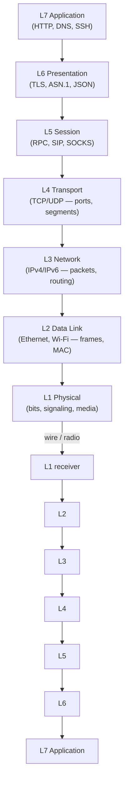

# OSI Model — Overview

## What it is
The **Open Systems Interconnection (OSI) model** is a seven-layer conceptual reference model, defined in the standard **ISO/IEC 7498-1**, that abstracts network communication into distinct functional layers, each with well-defined responsibilities and interfaces. It is a reference framework, not an implementation; real-world stacks like **TCP/IP** are practical approximations of it.

## Why it matters
It gives engineers a shared vocabulary for localizing faults ("is it an L3 routing problem or an L7 payload issue?"), scoping protocols to the right layer, and reasoning about where encryption, addressing, and reliability actually belong in a stack.

## How it actually works
Data passes top-down on the sender and bottom-up on the receiver, with each layer adding its own header (and sometimes trailer) via a process called **encapsulation**. The inverse on the receiving side is **decapsulation**. At each hop, only layers 1–3 are physically re-evaluated by intermediary nodes (routers, switches); layers 4–7 are end-to-end.

**Mnemonic (top→down):** **A**ll **P**eople **S**eem **T**o **N**eed **D**ata **P**rocessing.

The seven layers, top (closest to the user) to bottom (closest to the wire):

- **L7 — Application**
  - Purpose: network services exposed to end-user processes (HTTP, DNS, SMTP, SSH, FTP, SNMP).
  - Interface to user software: sockets, URI handling, TLS as a sublayer, DNS resolution APIs (`getaddrinfo`).
  - **PDU:** **data** (no OSI-imposed structure; the payload the app hands down).
  - A common misconception: "Application layer = the app." In OSI terms, it is the protocol layer *the app talks to* (e.g., `curl` talks to libcurl, libcurl talks to L7 HTTP), not the application itself.

- **L6 — Presentation**
  - Purpose: syntax and semantics of exchanged data — encoding (e.g., **ASN.1/BER/DER**, **JSON**, **Protobuf**, **TLS record framing**), compression, and encryption.
  - **TLS 1.2/1.3** conceptually sits here, though in practice it is often implemented as a library between L7 and L4.
  - **PDU:** **data**.

- **L5 — Session**
  - Purpose: controls dialogues between hosts — establishing, maintaining, and terminating sessions; checkpointing, recovery, and duplex/half-duplex control.
  - Concrete protocols traditionally placed here: **RPC**, **NetBIOS**, **PPTP**, **SOCKS**, **SIP**. In modern stacks, much of L5 functionality has collapsed into L7 (e.g., HTTP/2 streams, gRPC channels).
  - **PDU:** **data** or **SPDUs (Session Protocol Data Units)** in strict OSI terms.

- **L4 — Transport**
  - Purpose: end-to-end channels between host processes; multiplexing via **ports**, reliability, ordering, flow control, congestion control.
  - Protocols: **TCP** (connection-oriented, reliable, byte-stream), **UDP** (connectionless, datagram, no retransmission), **SCTP**, **DCCP**, **QUIC**.
  - **PDU:** **segment** (TCP) or **datagram** (UDP).
  - TCP header is 20 bytes minimum (up to 60 with options): source port, dest port, seq num (32b), ack num (32b), data offset (4b), reserved, flags (SYN/ACK/FIN/RST/PSH/URG/ECE/CWR), window (16b), checksum (16b), urgent pointer (16b).
  - UDP header is fixed **8 bytes**: src port, dst port, length, checksum (optional in IPv4, mandatory in IPv6).

- **L3 — Network**
  - Purpose: end-to-end packet forwarding across networks; logical addressing and routing.
  - Protocols: **IP (IPv4, IPv6)**, **ICMP**, **IGMP**, **OSPF**, **BGP**, **IPsec** (partly), **ARP** (technically L2.5 but commonly grouped here).
  - **PDU:** **packet** (more precisely, **datagram** in connectionless IP).
  - IPv4 header is 20 bytes minimum (up to 60 with options); key fields: version (4b), IHL, DSCP/ECN, total length (16b), identification, flags (DF, MF), fragment offset (13b), TTL (8b), protocol (8b), header checksum (16b), src/dst IPv4 (32b each).
  - IPv6 header is fixed **40 bytes**: version, traffic class, flow label (20b), payload length (16b), next header (8b), hop limit (8b), src/dst (128b each).

- **L2 — Data Link**
  - Purpose: reliable transfer across a single link; framing, MAC addressing, error detection (CRC), media access control.
  - Sublayers: **LLC (Logical Link Control, IEEE 802.2)** and **MAC (Media Access Control)**.
  - Protocols: **Ethernet (IEEE 802.3)**, **Wi-Fi (IEEE 802.11)**, **PPP**, **HDLC**, **Frame Relay**, **MPLS** (often called L2.5).
  - **PDU:** **frame**.
  - Ethernet II frame: 14-byte header (dst MAC 6B, src MAC 6B, EtherType 2B) + payload + 4-byte FCS (CRC-32). Maximum transmission unit (MTU) for classic Ethernet is **1500 bytes** of payload; with **jumbo frames**, up to **9000 bytes**.

- **L1 — Physical**
  - Purpose: raw bit transmission over a physical medium — electrical signals, optical pulses, RF modulation, connector specs, bit timing.
  - Standards: **IEEE 802.3** (10BASE-T, 100BASE-TX, 1000BASE-T, 10GBASE-T), **802.11** PHY, **OC-192/STM-64** (SONET/SDH), **USB**, **Bluetooth** radio.
  - **PDU:** **bit**.
  - Defines parameters such as voltage levels, impedance, max cable length (e.g., 100 m for 100BASE-TX Cat5e), line coding (Manchester, NRZ, PAM), and bandwidth in **bit/s** or **baud**.

**Encapsulation mechanics in detail (sender):**
1. L7 produces application data.
2. L6 may encrypt/compress; result handed to L5.
3. L5 attaches session control info.
4. L4 attaches its header → segment/datagram (TCP/UDP).
5. L3 attaches IP header → packet; routers may decrement **TTL** and recompute header checksum at each hop.
6. L2 attaches MAC header + FCS → frame.
7. L1 transmits bit stream, encoding it per the physical standard.

**Receiver:** inverse order. Intermediate routers strip L2, inspect/rewrite L3, and re-encapsulate in new L2 — L4 and above are untouched end-to-end.

## Architecture / flow


## Key terms
- **PDU (Protocol Data Unit)** — the unit of data at a given layer: bit (L1), frame (L2), packet (L3), segment (L4), data (L5–L7).
- **Encapsulation** — adding a layer-specific header (and optionally trailer) to the SDU passed down from the layer above.
- **MTU (Maximum Transmission Unit)** — the largest L3 packet that can traverse an L2 frame without fragmentation; standard Ethernet MTU = 1500 bytes.
- **SAP (Service Access Point)** — the conceptual interface between adjacent layers; in practice, sockets for L4↔L7, EtherType/LLC SAPs for L2↔L3.
- **End-to-end principle** — functions like reliability, encryption, and ordering belong only at the endpoints; intermediate nodes only forward.
- **OUI (Organizationally Unique Identifier)** — the first 24 bits of a MAC address, assigned by IEEE to identify the manufacturer.

## Example
A single HTTP GET packet over Ethernet (sizes, not bytes):
```text
[Ethernet header 14B][IP header 20B][TCP header 20B][TCP options?][HTTP payload]
                                                       └─ checksum, ports, seq/ack
└─ src/dst MAC, EtherType 0x0800 (IPv4)
                └─ src/dst IP, TTL, protocol=6 (TCP)
```
Demonstrates how each layer's header prefixes the previous layer's data — encapsulation made concrete.

## Common mistakes
- **Treating OSI as an implementation** — TCP/IP is what actually ships on the wire; OSI is the conceptual reference for naming and scoping.
- **Confusing "Application layer" with the user's application** — `curl` itself is not L7; the HTTP protocol it speaks is.
- **Assuming TLS is L5 or L7** — TLS is L6 (presentation) by OSI definition; it sits below the app protocol and above TCP.
- **Expecting strict layer isolation** — protocols like **ICMP**, **ARP**, **IPsec**, and **QUIC** span or blur boundaries; QUIC deliberately fuses L4 + L5–7 into UDP for performance.
- **Forgetting that routers only touch L1–L3** — NAT, firewall state, and DSCP rewriting are the limit of mid-path modifications; the TCP stream itself is opaque to routers.

## Lesser-known internals
- **Strict OSI conformance requires L5 checkpointing and resynchronization**, a feature almost no modern protocol exposes; that's why L5 is effectively a ghost layer in today's stacks.
- **The OSI session/transport header format (OSI TP4)** included an explicit *duplicate detection window* and *expedited data* flag — concepts TCP partially re-invents via `SACK`, `DSACK`, and *urgent pointer*.
- **EtherType values ≥ 0x0600** indicate the L3 protocol (e.g., `0x0800` = IPv4, `0x86DD` = IPv6, `0x8100` = 802.1Q VLAN tag, which itself is a 4-byte shim between L2 and the rest), revealing that L2 carries a length *or* type — but never both simultaneously.
- **The model explicitly forbids "violations"** such as a layer skipping its neighbor; in practice, applications frequently read directly from L4 sockets, effectively bypassing L5/L6 abstractions — a pragmatic departure from the standard.

## Topics to explore further
- **TCP/IP 4-layer model** (Link, Internet, Transport, Application) — the practical stack that actually maps to the internet.
- **Encapsulation vs. tunneling** (GRE, VXLAN, GENEVE) — how protocols deliberately re-encapsulate through multiple OSI-equivalent stacks.
- **QoS and DSCP/ToS** — how L3 marking affects L2 queueing (802.1p) and physical scheduling.
- **OSI conformance testing (ISO 9646)** — the formal test methodology that once drove vendor certification.

## Learn next
- **TCP/IP stack** — the real-world mapping onto the OSI layers and where it diverges.
- **Encapsulation in detail** — exact byte-level headers for Ethernet, IPv4, and TCP.
- **Wireshark fundamentals** — to observe each layer's PDU on live traffic.