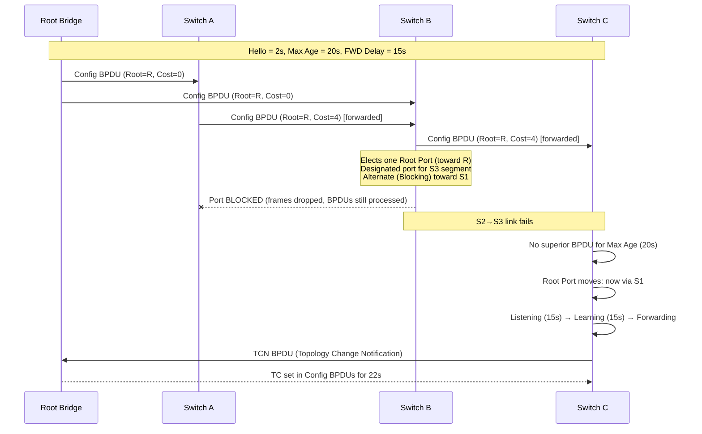

# Spanning Tree Protocol (STP)

## What it is
Spanning Tree Protocol is a Layer 2 link-management protocol defined in **IEEE 802.1D** that prevents switching loops in Ethernet bridges/switches by constructing a loop-free logical topology — a spanning tree — over a physically redundant mesh. It selectively blocks redundant paths and activates them only when the active path fails, while continuously exchanging Bridge Protocol Data Units (BPDUs) to maintain the tree.

## Why it matters
Any nontrivial switched Ethernet deployment with redundant links between switches will form a Layer 2 loop without STP, and a single broadcast frame circulating forever will saturate the network within seconds (a broadcast storm). Engineers debug mysterious outages, asymmetric routing, and slow reconvergence failures rooted in STP misconfiguration far more often than they expect.

## How it actually works

### The problem STP solves
Ethernet frames have no TTL. A broadcast or unknown-unicast frame forwarded by two switches that both have two paths to each other will be copied indefinitely. Beyond the storm, this also causes MAC address table flapping (the same MAC seen on multiple ports) and frames being delivered in duplicate.

STP solves this by electing **one root bridge** for the entire Layer 2 domain, then forcing every other bridge to compute exactly **one shortest path to the root**. Any port that is not on a shortest path is put into the **Blocking** state — frames are neither forwarded nor learned from, but BPDUs are still processed.

### BPDU — the protocol's heartbeat
STP communicates using frames called **Configuration BPDUs**, sent to the reserved Layer 2 multicast destination MAC `01:80:C2:00:00:00` (the `802.1D` Slow Protocols group address; also used by RSTP, MSTP, LACP, etc.). EtherType is `0x0022` (LLDP uses `0x88CC`; STP itself rides directly over Ethernet, no IP).

A Configuration BPDU contains:

| Field | Size | Purpose |
|---|---|---|
| Protocol ID | 2 bytes | Always `0x0000` for STP |
| Protocol Version | 1 byte | `0` for classic STP, `2` for RSTP, `3` for MSTP |
| BPDU Type | 1 byte | `0x00` Configuration, `0x80` TCN (Topology Change Notification) |
| Flags | 1 byte | bit 7 = Topology Change, bit 0 = TC Acknowledgement (in TCN ACK) |
| Root Bridge ID | 8 bytes | Priority (2) + System ID extension (1) + MAC (6) of the perceived root |
| Root Path Cost | 4 bytes | Sender's cumulative cost to the Root |
| Bridge ID | 8 bytes | Sender's own priority + MAC |
| Port ID | 2 bytes | Sender's port identifier (priority 4 bits, port number 12 bits) |
| Message Age | 2 bytes | Seconds since the root originated this BPDU |
| Max Age | 2 bytes | `20 s` default — discard BPDU as stale beyond this |
| Hello Time | 2 bytes | `2 s` default — root's BPDU cadence |
| Forward Delay | 2 bytes | `15 s` default — Listening→Learning and Learning→Forwarding timers |

The Bridge ID has historically been `8 bytes`: a 2-byte **Bridge Priority** (default `32768`, increments of `4096`), 1-byte System ID extension (used by MSTP for instance ID), and 6-byte MAC address. RSTP/MSTP use a 2-byte priority with 4 bits of priority + 12 bits of System ID extension; classic 802.1D effectively treats the full 16 bits as priority.

### Path cost
The cost to reach the root is the sum of per-link port costs along the path. IEEE 802.1D originally specified values tied to 10 Mbps:

| Link speed | Original cost | Revised (802.1D-2004+) cost |
|---|---|---|
| 10 Mbps | `100` | `2,000,000` |
| 100 Mbps | `19` | `200,000` |
| 1 Gbps | `4` | `20,000` |
| 10 Gbps | `2` | `2,000` |

The algorithm is `cost = reference / link_speed`, with the reference dropping from `200,000,000` to `2,000,000` to handle higher speeds without overflow. Many vendors use their own tweaked tables; you can override per-port.

### Root bridge election
Every bridge initially believes it is the root and puts its own Bridge ID in the Root Bridge ID field of BPDUs it sends on all ports every Hello Time. The algorithm is:

1. Receive a BPDU on a port.
2. If `BPDU.RootBridgeID < Self.RootBridgeID`, adopt that as the new believed root and compute `Root Path Cost = BPDU.RootPathCost + port_cost`.
3. If `BPDU.RootBridgeID == Self.RootBridgeID`:
   - If `BPDU.RootPathCost < Self.RootPathCost`, the upstream bridge is closer — adopt its path cost.
   - If equal, tie-break on `Sender Bridge ID`, then `Sender Port ID`.
4. Forward the (possibly updated) BPDU out all **Designated** ports.

Convergence ends when one bridge — the **Root Bridge** — remains because no incoming BPDU has a superior Root Bridge ID. Because the lowest Bridge ID wins, the lowest Bridge Priority wins; the MAC tiebreak is why leaving defaults causes the oldest (lowest-MAC) switch to become root, almost always a bad outcome.

### Port roles (per VLAN)
For each segment (VLAN), exactly one port becomes the **Designated Port** — the one with the lowest Root Path Cost to the root, tiebroken by Bridge ID. The bridge that owns that port is the **Designated Bridge** for that segment. Each non-root bridge elects exactly one **Root Port**: the port with the lowest cost path to the root (tiebreak: sender Bridge ID, then sender Port ID). Any port that is neither Root nor Designated is **Alternate** (in RSTP terms) or **Blocking/Non-Designated** in classic STP terminology — these are the redundant ports STP actually blocks.

### Classic STP port states (802.1D)
Every non-edge port cycles through five states:

| State | Forwards frames? | Learns MACs? | Receives/processes BPDUs? |
|---|---|---|---|
| **Disabled** | No | No | No (admin down) |
| **Blocking** | No | No | Yes |
| **Listening** | No | No | Yes |
| **Learning** | No | Yes | Yes |
| **Forwarding** | Yes | Yes | Yes |

The transition timers are fixed by the root and copied into every BPDU:

- **Blocking → Listening**: triggered when a port is selected by the new topology (Max Age elapsed since last superior BPDU, or new superior BPDU received).
- **Listening → Learning**: after **Forward Delay (`15 s`)**.
- **Learning → Forwarding**: after another **Forward Delay (`15 s`)**.

So a worst-case failover in classic STP from link failure to traffic restoration is `Max Age + 2×Forward Delay = 20 + 30 = 50 seconds`. The Listening state is essentially wasted: it exists so that any BPDU loops still in flight can be drained before MAC learning begins and frames start being flooded.

### Topology change handling
When a port transitions to Forwarding, or a bridge detects a link failure, it originates a **TCN BPDU** (BPDU Type `0x80`) out its Root Port. Each upstream bridge acknowledges and forwards it toward the root. The root then sets the **Topology Change (TC) flag** in Configuration BPDUs for `Hello Time + Max Age = 22 s` (one full Max Age cycle). Receiving bridges, on seeing TC, flush all MAC addresses except those learned on the TC-causing port, and reduce the aging timer to **Forward Delay (`15 s`)** for that period. This causes a temporary flood-everything-and-relearn churn across the whole VLAN.

### Why classic STP feels slow
Three things conspire:

1. BPDUs are only sent every `2 s` and a port waits `Max Age = 20 s` (10 missed hellos) before declaring its root dead.
2. Two separate `15 s` Forward Delay stages before forwarding.
3. Topology Change causes a full VLAN-wide MAC flush, forcing unicast flooding during reconvergence.

These are the reasons **RSTP (802.1w, later folded into 802.1D-2004 and now 802.1Q)** and **MSTP (802.1s, also in 802.1Q)** exist — but they all interoperate at the BPDU level: RSTP switches send 802.1D-compatible BPDUs to legacy switches and fall back to timers on shared segments.

## Architecture / flow



## Key terms
- **BPDU** — Bridge Protocol Data Unit; the control frames STP switches exchange to build and maintain the tree. Two subtypes: Configuration (`0x00`) and TCN (`0x80`).
- **Bridge ID** — 8-byte unique identifier per switch: 2-byte priority + 6-byte MAC (and a System ID extension byte for MSTP). Lowest value wins the root election.
- **Root Port** — The single port on each non-root bridge that lies on the shortest path to the root; never blocked.
- **Designated Port** — The single port per segment responsible for forwarding traffic toward the root for that segment; elected by lowest Root Path Cost, then Bridge ID.
- **Alternate / Blocking Port** — A port that is neither Root nor Designated; the redundant path that STP disables to break the loop.
- **TCN** — Topology Change Notification BPDU; tells the root that the topology changed so MAC tables can be flushed.

## Example

```cisco
! Cisco IOS — enforce a deterministic root and tune timers on a core switch.
spanning-tree mode rapid-pvst          ! per-VLAN RSTP (Cisco default in modern IOS)
spanning-tree vlan 1-4094 priority 0   ! force this switch to be root for ALL VLANs
spanning-tree vlan 1-4094 root primary ! same effect, auto-derived priority
!
! On access-facing ports — never let an access switch become root:
interface GigabitEthernet0/1
 spanning-tree portfast          ! skip Listening/Learning on edge ports
 spanning-tree bpduguard enable  ! shut the port if a switch is plugged in
```

`portfast` lets edge ports jump straight to Forwarding (legal because there's only one path), and `bpduguard` shuts the port if a BPDU ever arrives — both prevent an unauthorized switch from participating in STP and accidentally winning the root election.

## Common mistakes
- **Leaving Bridge Priority at the default `32768`** on every switch. The election falls back to the lowest MAC, which is usually the oldest, slowest switch — a guaranteed outage later when it fails. Set the root explicitly (priority `0` or `4096`) and set priorities on the backup root higher than all access switches.
- **Assuming `portfast` is safe on a trunk or uplink.** A `portfast` trunk skips all STP states on enable — if a loop exists on that trunk, you get an instant storm. `portfast trunk` exists in newer code but requires `bpduguard` to be safe.
- **Blocking BPDUs end-to-end with `bpdufilter` instead of `bpduguard`.** `bpdufilter` *stops* the port from sending BPDUs, which silently breaks STP without telling anyone; if that filtered port loops back to another filtered port, you have an undetected storm.
- **Ignoring asymmetric `Root Path Cost` due to mismatched speed or duplex.** Auto-negotiated 100/half links report cost `19` instead of full-speed cost `4` (or the reverse with revised cost tables) and shift which side's BPDU "wins" the Designated role, causing one side to forward and the other to block unexpectedly.
- **Forgetting that TCN flushes MAC tables across the entire VLAN.** A single flapping link can cause hundreds of endpoints to flood unicast for ~30 seconds, saturating uplinks even though STP itself is stable.

## Lesser-known internals
- **STP BPDUs have no IP header and no TTL.** They are bridged like data frames. If a Layer 2 loop exists and STP is misconfigured such that BPDUs can also loop, the same storm problem affects control traffic — this is why the protocol explicitly defines the `01:80:C2:00:00:00` group address as non-forwardable by default on customer-facing ports (the `802.1D` reserved group is filtered by most switches).
- **The Designated Port for a segment is decided by the segment, not by the root.** On a point-to-point link between two non-root bridges, both sides initially claim to be the Designated Bridge; the one with the lower Root Path Cost (then Bridge ID) wins. A bridge can simultaneously have a Designated Port and a Root Port — they answer different questions.
- **`Message Age` increases by `1` at every hop and is decremented from `Max Age` by each bridge.** A BPDU that has been bouncing around a broken segment can silently exceed Max Age and be discarded mid-flight, which is one way loops masquerade as "STP is flapping" symptoms.
- **Classic STP requires `Max Age` ≥ `2×Hello Time` and `2×(Forward Delay - 1) ≥ Max Age`.** Violate this and the protocol refuses to converge — you can spot bad configs by checking that all three timers are consistent across the domain.
- **A bridge will keep forwarding if it stops receiving BPDUs from the root for *less* than Max Age.** A short BPDU outage (network blip, switch reboot) is therefore masked — until it isn't, at which point a 50-second reconvergence hits.

## Topics to explore further
- **RSTP (802.1w / IEEE 802.1Q Clause 17)** — same BPDU format but Proposal/Agreement handshake, no Listening state, sub-second reconvergence; the practical replacement for classic STP.
- **MSTP (802.1s / IEEE 802.1Q Clause 13)** — maps multiple VLANs to a few STP instances to reduce CPU load on large VLAN counts while keeping per-region loops broken.
- **Storm control / broadcast suppression** — the Layer 2 companion to STP; limits how bad things get if a loop slips through.
- **PVST and Rapid PVST+** — Cisco per-VLAN STP variants; explain why a "VLAN 1 root" and "VLAN 10 root" can be different switches on the same physical topology.

## Learn next
- **RSTP (802.1w)** — same problem, sub-second recovery; essential next step from classic STP.
- **EtherChannel / LACP (802.1AX / 802.3ad)** — bundles links so STP doesn't block half your bandwidth.
- **TRILL / SPB (802.1Q Clause 7+)** — replaces STP entirely with link-state routing at Layer 2; the long-term answer to STP's scaling limits.