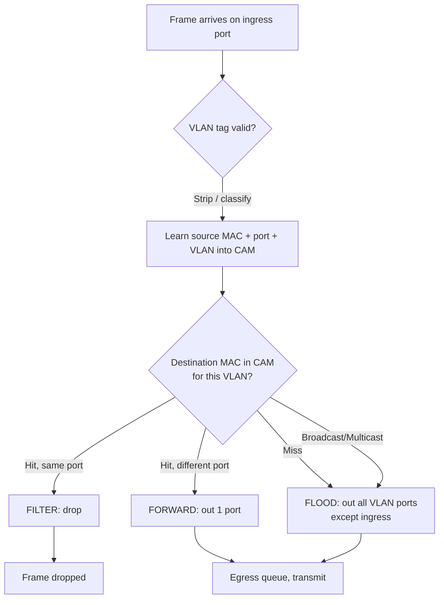

# Switches & How They Work

## What it is
A network switch is a Layer 2 (Data Link) device that forwards Ethernet frames between connected devices using **MAC addresses** rather than IP addresses, operating transparently to the hosts attached to it. It maintains a forwarding table — the MAC address table — that maps each MAC address to the physical switch port where that address was observed, and uses that table to make per-frame forwarding decisions at line rate in dedicated ASIC hardware.

## Why it matters
Every developer eventually debugs a "the server can't reach the database" or "why is this VLAN slow" problem that bottoms out in switch behavior — broadcast storms, MAC table exhaustion, asymmetric routing, STP loops, or a misconfigured trunk port. Knowing what a switch actually does frame-by-frame is the difference between guessing and diagnosing.

## How it actually works

### The MAC address table (CAM table)

The core data structure is the **CAM table** (Content Addressable Memory) — a hardware-associative store on the switch ASIC that lets the switch look up a destination MAC address and retrieve the egress port in a single clock cycle, rather than walking a software hash table. Each entry typically holds:

- **VLAN ID** — which VLAN the MAC was learned on
- **MAC address** — the 48-bit IEEE 802 MAC
- **Port** — the physical/logical egress interface
- **Aging timer** — typically **300 seconds (5 minutes)** by default on Cisco switches; reset on each frame seen from that MAC

The CAM table is finite. Typical capacity is in the range of 8K–128K entries depending on the model. When full, new MACs cannot be learned and the switch falls back to flooding for those destinations.

### Frame processing pipeline

For every frame received on an ingress port, the switch performs these steps in hardware in a fixed order:

1. **Ingress port check** — verify the port is up, not err-disabled, and the frame passes basic validity (correct FCS, minimum size 64 bytes, max 1518/1522 with VLAN tag, or up to 9216 with jumbo frames enabled).
2. **VLAN tagging / 802.1Q processing** — if the frame arrives on a trunk, the switch strips/adds the 4-byte 802.1Q tag (`TPID 0x8100`, `TCI` containing 12-bit VLAN ID + 3-bit PCP + 1-bit DEI). Access ports associate all untagged frames with a configured VLAN.
3. **Source MAC learning** — the switch records the frame's source MAC plus ingress port and VLAN in the CAM table. If the MAC already exists but on a different port, the entry is **moved** (MAC address move) and may trigger a security action. If the MAC exists on the same port, the aging timer is refreshed.
4. **Destination lookup** — the switch looks up the frame's destination MAC in the CAM table, restricted to entries in the **same VLAN** (a VLAN is its own L2 broadcast domain).
5. **Forward, flood, or filter decision**:
   - **Forward** — known unicast in same VLAN → forward out exactly one port (unicast).
   - **Flood** — unknown unicast, broadcast (`FF:FF:FF:FF:FF:FF`), or multicast (in default behavior) → forward out all ports in the VLAN **except** the ingress port.
   - **Filter** — same port as source (hair-pin on same VLAN is dropped), or blocked by STP, or dropped by an ACL.
6. **Egress** — frame is queued and sent on the destination port(s).

This entire pipeline runs in hardware with deterministic latency, typically measured in microseconds, independent of the number of entries in the CAM.

### Learning vs. flooding vs. forwarding

- **Learning** is the *write* side: populating the CAM from observed source MACs. It is implicit, automatic, and happens on every frame.
- **Flooding** is the *read* side when lookup misses: the switch has no idea where the destination lives, so it sends the frame everywhere in the VLAN. This is why a switch with an empty CAM (cold start) causes a brief burst of floods — and why ARP itself relies on flooding to resolve IP→MAC in the first place.
- **Forwarding** is the *read* side when lookup hits: known unicast goes to exactly one port.

The cold-start flood is a normal consequence of the model — switches cannot predict; they only remember. The standard mitigation is **MAC address notification / topology-driven learning**, but fundamentally the design is "flood until learned, then unicast forever (until aging)."

### Filtering database (FDB) and VLAN interaction

The IEEE 802.1Q-2018 standard (and 802.1D for bridging) defines a **Filtering Database** per bridge. Each VLAN has its own logical FDB; a MAC learned on VLAN 10, port 3 is *not* visible to VLAN 20. This is what makes VLANs true L2 broadcast domains and is why "MAC move" notifications often include the VLAN in the log line.

### Cut-through vs. store-and-forward

Two forwarding modes exist:

- **Store-and-forward** — the entire frame is buffered and the CRC (FCS) is verified before any forwarding decision. Errors and runt frames are dropped. This is the default on virtually all modern managed switches.
- **Cut-through** — the switch begins forwarding after reading only the destination MAC (and optionally the first 64 bytes for "error-dirty cut-through"). Latency is lower but corrupted frames are propagated. Common in low-latency trading switches.

### Broadcast, multicast, unknown unicast

All three share the same flood behavior in the default configuration. Multicast can be optimized via **IGMP snooping** (RFC 4541), which lets the switch listen to IGMP membership reports and restrict multicast flooding to ports that have joined the relevant group. Without IGMP snooping, multicast behaves like broadcast.

### Storm control and protection

Because a misbehaving host or loop can saturate a VLAN with broadcasts, switches implement:

- **Storm control** — per-port, per-traffic-class thresholds (typically in pps or bps) that err-disable a port or drop traffic exceeding the limit.
- **BPDU Guard / Root Guard / Loop Guard** — STP-side protections discussed in the Spanning Tree article.
- **Dynamic ARP Inspection, DHCP Snooping** — built on top of the MAC table to validate Layer 2/3 correspondence.

## Architecture / flow



## Key terms
- **CAM (Content Addressable Memory)** — hardware associative memory used for the MAC table; lookup is constant-time by content, not address.
- **FDB (Filtering Database)** — the IEEE 802.1Q term for the per-VLAN MAC address table.
- **Flooding** — sending a frame out all ports in the VLAN except the ingress port, used for unknown unicast and broadcast.
- **Cut-through switching** — forwarding mode where the switch begins transmitting before the full frame is received, minimizing latency at the cost of error propagation.
- **802.1Q** — IEEE standard for VLAN tagging on Ethernet trunks; tag is 4 bytes (TPID `0x8100` + TCI).
- **Aging timer** — countdown (default 300s) after which an unused CAM entry is purged.

## Example

```bash
# Cisco IOS — inspect the MAC address table on a switch
show mac address-table
#   Vlan    Mac Address       Type        Ports
#   ----    -----------       --------    -----
#   10      0011.2233.4455    DYNAMIC     Gi0/1
#   20      aabb.ccdd.eeff    STATIC      Gi0/2

# Show CAM entries for a specific VLAN and verify aging timer
show mac address-table aging-time
#   Vlan    Aging Time
#   ----    ----------
#   10      300

# Watch a MAC move in real time (security/loop diagnostic)
show mac address-table notification
```

This demonstrates that CAM entries are per-VLAN, dynamic by default, and aged out after the default 5-minute idle window.

## Common mistakes
- **Assuming CAM is shared across VLANs.** A MAC in VLAN 10 is invisible to VLAN 20 — debugging "host not reachable" by looking at the wrong VLAN's FDB is a classic trap.
- **Confusing `FF:FF:FF:FF:FF:FF` broadcast floods with unknown-unicast floods.** Both look identical on the wire, but they have different causes — broadcast is by design, unknown-unicast floods mean the CAM is incomplete or the destination moved.
- **Believing the CAM is infinite.** Exhaustion (often by a flapping port causing rapid MAC moves, or by a guest VLAN with thousands of devices) turns the switch into a flooding hub and is one of the most common causes of "the network suddenly got slow after we connected the Wi-Fi."
- **Forgetting that source MAC learning rewrites the CAM.** A device that legitimately moves ports updates its CAM entry silently; a loop or spoofing attack can cause constant MAC moves and thrash the table.

## Lesser-known internals
- **MAC moves can be silently rate-limited.** To protect the CAM from rapid churn during topology changes, many switch ASICs limit the rate of MAC-learning events; sustained high churn can silently drop new source MACs, causing traffic to be flooded for those hosts with no log entry.
- **The 300-second aging timer is reset by *any* observed frame from that MAC**, including frames the switch is merely bridging — not just traffic destined for the host. A chatty but idle host can hold its CAM entry indefinitely, which is why "the entry should have aged out" is often wrong.
- **Private VLANs (RFC 5517) break the simple "one VLAN = one broadcast domain" assumption**: in a PVLAN, promiscuous ports see traffic from isolated and community ports, but isolated ports cannot talk to each other even within the same VLAN — the switch enforces this at the FDB lookup, not via ACL.

## Topics to explore further
- **Spanning Tree Protocol (STP / RSTP / MSTP)** — IEEE 802.1D/802.1w/802.1s; prevents L2 loops by blocking redundant paths and is tightly coupled with CAM behavior.
- **IGMP Snooping and Multicast VLAN Registration (MVR)** — RFC 4541; optimizes multicast flooding using CAM-like group tables.
- **Link Aggregation (LACP, 802.1AX)** — bundles multiple physical ports into one logical port; the CAM then points at a port-channel.
- **Switch ASIC internals (Broadcom Trident, Cisco Silicon One)** — how TCAM (Ternary CAM) is used alongside CAM for ACL and QoS lookups.

## Learn next
- **Spanning Tree Protocol** — the loop-prevention protocol every switch runs by default; pairs directly with MAC learning.
- **VLANs and 802.1Q trunking** — the per-VLAN FDB and tagging format are inseparable from switch operation.
- **ARP and broadcast domains** — ARP depends on switch flooding; understanding ARP cements why flooding exists.