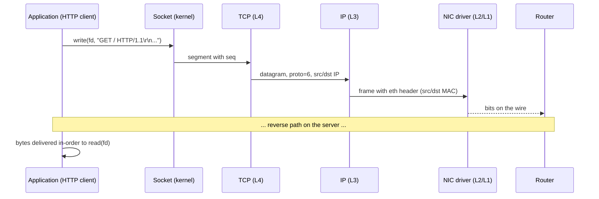

# TCP/IP Model

## What it is
A four-layer networking reference model formalized in **RFC 793 (TCP)** and **RFC 791 (IP)**, and later codified as a model in **RFC 1122** and **RFC 1123**. It defines how data moves between hosts on a packet-switched internetwork, from the application producing bytes to the physical medium carrying electrical or optical signals. The model is the operational reality of the internet — OSI is the pedagogical reference; TCP/IP is what every socket, NIC, and router actually implements.

## Why it matters
Every networked application you write — HTTP, DNS, gRPC, WebSocket, database drivers — sits on top of this stack. Understanding which layer a problem lives at (DNS resolution at L7 vs. MTU at L2, TCP retransmit at L4 vs. routing at L3) is the difference between debugging the network for hours vs. minutes.

## How it actually works

### The four layers

1. **Application** — protocols the process uses directly: HTTP (80/tcp), HTTPS (443/tcp), SSH (22/tcp), DNS (53), TLS, FTP, SMTP (25), NTP (123/udp). Data unit: **message** or **stream**.
2. **Transport** — end-to-end channels between two host ports. Two protocols:
   - **TCP** (RFC 793): connection-oriented, reliable, byte-stream, ordered. Default header is **20 bytes**.
   - **UDP** (RFC 768): connectionless, unreliable, datagram. Header is fixed **8 bytes**.
3. **Internet** — host-to-host packet delivery via **IP**. Two versions in current use:
   - **IPv4** (RFC 791): 32-bit addresses, header minimum **20 bytes**.
   - **IPv6** (RFC 8200): 128-bit addresses, fixed header **40 bytes**.
4. **Link (Network Access)** — framing for the physical medium: Ethernet (IEEE 802.3), Wi-Fi (IEEE 802.11), PPP, SLIP. Data unit: **frame**.

### Encapsulation

Each layer adds its own header (and sometimes trailer) to the data it receives from the layer above. On transmit:

```
| App data    |
| TCP header  | App data          |
| IP header   | TCP hdr | App data|
| Eth header  | IP hdr | TCP | App | Eth trailer |
```

On receive, each layer strips its corresponding header and passes the payload up. This is the entire reason "TCP/IP" is a single phrase — they are tightly coupled: TCP segments are carried inside IP datagrams, and IP datagrams depend on TCP/ICMP/etc. to make the internet usable.

### What the headers actually contain

**TCP header (20-byte base, up to 60 with options):**
- Source port (16), Destination port (16)
- Sequence number (32) — byte offset of the first byte in this segment
- Acknowledgment number (32) — next expected byte from the other side
- Data offset (4), Reserved (3), **Flags** (9 bits: NS, CWR, ECE, URG, ACK, PSH, RST, SYN, FIN), Window size (16)
- Checksum (16), Urgent pointer (16)
- Options (variable, padded to 32-bit boundary)

**IPv4 header (20-byte base, up to 60 with options):**
- Version (4) = 4, IHL (4), DSCP (6), ECN (2)
- Total Length (16), Identification (16), Flags (3) + Fragment Offset (13)
- TTL (8), Protocol (8) = 6 for TCP / 17 for UDP / 1 for ICMP, Header Checksum (16)
- Source IP (32), Destination IP (32)

**UDP header (8 bytes):** source port (16), destination port (16), length (16), checksum (16).

### How TCP actually delivers reliability

TCP is a sliding-window protocol with cumulative acknowledgments. The sender maintains a send window; the receiver advertises a receive window via the **Window Size** field (16 bits, scaled by the Window Scale option — up to **14** additional bits, giving a max window of **1 GiB**).

Reliability mechanics:
- **Sequence numbers** are 32-bit byte counters, not packet counters. Initial sequence numbers (ISN) are randomized per connection (RFC 6528 / earlier guidance) to defeat off-path spoofing of in-flight segments.
- **Retransmission timeout (RTO)** is computed from a smoothed round-trip time (SRTT) and RTT variance (RTTVAR) using the Jacobson/Karels algorithm (RFC 6298). The formula:
  - `SRTT' = (1 - α) · SRTT + α · R'`, where `α = 1/8`
  - `RTTVAR' = (1 - β) · RTTVAR + β · |SRTT - R'|`, where `β = 1/4`
  - `RTO = SRTT + max(G, K · RTTVAR)`, where `K = 4`, `G = clock granularity`
  - First measurement: `SRTT = R`, `RTTVAR = R/2`, `RTO = SRTT + max(G, K·RTTVAR)`
- **Karn's algorithm**: do not measure RTT on retransmitted segments (ambiguous).
- **Fast retransmit**: receiver sends a duplicate ACK on an out-of-order segment; sender retransmits after **3** duplicate ACKs without waiting for RTO (RFC 5681).
- **Congestion control**: standardized algorithms include **Reno/NewReno**, **CUBIC** (default in Linux), and **BBR**. CUBIC's window growth function is `W(t) = C · (t - K)³ + W_max`, where `C` is a constant (typically 0.4), `K` is the time to reach `W_max` after a loss event, and `W_max` is the window size at the last loss.

### Connection lifecycle (TCP)

State transitions defined in RFC 793:
1. **CLOSED** → server `listen()` → **LISTEN**; client `connect()` sends **SYN** → **SYN-SENT**.
2. Server receives SYN, sends **SYN+ACK** → **SYN-RECEIVED**.
3. Client sends **ACK** → **ESTABLISHED**. Server receives ACK → **ESTABLISHED**.
4. Either side `close()` → **FIN-WAIT-1**, sends FIN → **FIN-WAIT-2** (after ACK received), then times out after **2 × MSL** (Maximum Segment Lifetime, default **60 s**, configurable via `TCP_TIMEWAIT_LEN`) into **CLOSED**. The other side enters **CLOSE-WAIT**, then **LAST-ACK** after sending its own FIN.

### MTU and fragmentation

Ethernet's standard MTU is **1500 bytes**. If an IP datagram exceeds the outgoing link MTU, the sender fragments it (IPv4) or drops it with an **ICMPv6 Packet Too Big** (IPv6 — the sender is expected to use **Path MTU Discovery**, RFC 8201). IPv4 fragmentation uses the **Identification**, **Flags** (DF, MF), and **Fragment Offset** fields; reassembly is by tuple of source IP + destination IP + protocol + identification.

### Mapping to OSI

| OSI layer | TCP/IP layer | Examples |
|---|---|---|
| 7 Application | Application | HTTP, DNS, TLS |
| 6 Presentation | (folded into App) | — |
| 5 Session | (folded into App) | — |
| 4 Transport | Transport | TCP, UDP |
| 3 Network | Internet | IP, ICMP, ARP |
| 2 Data Link | Link | Ethernet, 802.11 |
| 1 Physical | Link | Fiber, copper, radio |

The mapping is lossy: OSI has distinct Session and Presentation layers that TCP/IP has no dedicated protocols for — TLS straddles Presentation and Application; RPC-style multiplexing covers some Session concerns.

## Architecture / flow



## Key terms
- **MTU** — Maximum Transmission Unit; the largest L3 packet that can traverse a link without fragmentation. Standard Ethernet = 1500 bytes.
- **MSS** — Maximum Segment Size; the largest TCP payload, typically `MTU - 40` (IPv4) or `MTU - 60` (IPv6) to avoid IP-level fragmentation.
- **Three-way handshake** — SYN, SYN+ACK, ACK exchange that establishes a TCP connection and synchronizes initial sequence numbers.
- **Port** — 16-bit identifier (1–65535) naming an endpoint on a host; ports 0–1023 are privileged on Unix.
- **NAT** — Network Address Translation; rewrites IP/port tuples at a router so many hosts share one public address; complicates inbound TCP because port mappings are stateful.

## Example

```bash
# Trace which protocol layers a connection actually traverses
# (no fictional framing — output format only; useful as a mental checklist)
ss -tni 'sport = :443 or dport = :443'
# Output columns include:
#   Recv-Q Send-Q  Local Address:Port  Peer Address:Port
#   cwnd ssthresh rtt mss  ... rcv_space
```

`ss` reads directly from kernel TCP control blocks — `cwnd` (congestion window), `ssthresh` (slow-start threshold), `rtt`, `mss` — exposing the L4 state TCP actually maintains, not just the L7 socket.

## Common mistakes
- Assuming **socket buffers are infinite**. TCP advertises a receive window based on `SO_RCVBUF`; if the application doesn't drain `read()`/`recv()`, the window closes to zero and the sender stops transmitting (zero-window deadlock).
- Confusing **MSS** with **window size**. MSS is negotiated during the handshake (default 536 for IPv4 without discovery, typically 1460 for Ethernet) and bounds segment payload; the window bounds bytes in flight.
- Setting `SO_LINGER` to 0 expecting a graceful close — this sends **RST** instead of FIN, discarding in-flight data and breaking peers that expect a clean EOF.
- Forgetting **TIME_WAIT**: a side that initiates the close lingers in TIME_WAIT for `2 × MSL` (typically 60–120 s) to absorb stray segments. Short-lived clients/load testers accumulate sockets here and can hit ephemeral port exhaustion.

## Lesser-known internals
- **TCP_NODELAY** disables **Nagle's algorithm**, which coalesces small writes to reduce the number of small segments. It is still on by default in most kernels and is the cause of many "why are my tiny requests so slow" investigations.
- The **urgent pointer** in TCP does not mark data as out-of-band in modern kernels — it points to a position in the byte stream, and `OOB` semantics are largely vestigial (and `MSG_OOB` reads exactly 1 byte of urgent data per RFC).
- **IPv4 header checksum is computed only over the IP header**, not the payload. It must be recomputed at every hop where TTL changes, which is why software routers are CPU-bound on forwarding rate.
- **Window Scale**, **Timestamps**, **SACK**, and **MSS** are options negotiated in the SYN — without them, modern high-bandwidth paths stall or underutilize the link, even though they all post-date RFC 793.

## Topics to explore further
- **TCP congestion control variants** (Reno, CUBIC, BBR, DCTCP) — different control laws, very different behavior on loss vs. bufferbloat paths.
- **QUIC** (RFC 9000) — transport over UDP that folds TLS in, sidesteps head-of-line blocking, and is the basis for HTTP/3.
- **PMTUD / Path MTU Discovery** — why ICMP black-holing breaks large packets and how `df-bit` flag interacts with tunneling (MSS clamping for VPN/overlay networks).
- **eBPF / socket hooks** — how modern tooling observes and modifies the stack without packet capture.

## Learn next
- **TCP congestion control** — the algorithms deciding *when* and *how much* to send are the heart of internet performance.
- **TLS 1.3 handshake** — the dominant L4–L5 protocol developers actually negotiate every day.
- **QUIC & HTTP/3** — the most significant divergence from TCP/IP's traditional layering in decades.