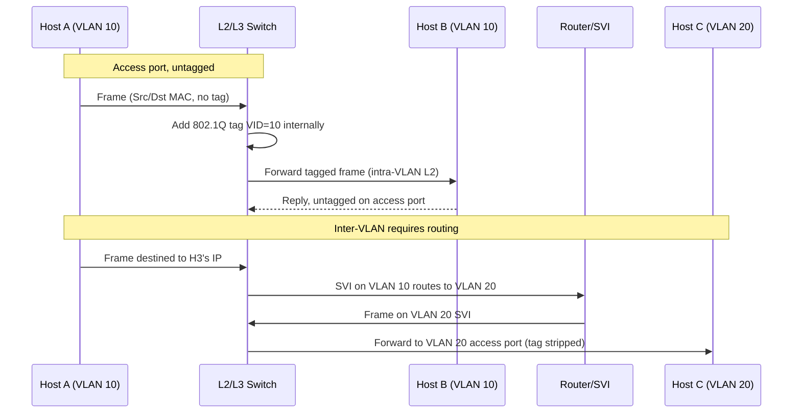

# VLANs

## What it is
A **VLAN** (Virtual Local Area Network) is a Layer 2 broadcast domain defined by a 12-bit identifier (values 1–4094) that partitions a switched network into logically separate segments, independent of physical topology. Frames are tagged with this identifier via the IEEE 802.1Q header so switches can keep traffic for different VLANs isolated on shared links.

## Why it matters
Developers hit VLANs whenever they deploy services across networks that segment by team, environment, or trust boundary — most commonly in cloud VPCs, on-prem data centers, or container/Kubernetes networking — because the VLAN (or its encapsulated equivalent) determines which hosts can reach a service on Layer 2 and which traffic must traverse a router.

## How it actually works

### Broadcast domain isolation
A traditional Ethernet switch floods broadcast, multicast, and unknown-unicast frames out every port except the ingress one. With VLANs, that flooding is constrained to ports (or tagged frames) belonging to the same VLAN. The switch maintains a **VLAN membership table** mapping each access port to a single VLAN ID, and a separate table for trunk ports carrying multiple VLANs.

### 802.1Q tagging
IEEE 802.1Q inserts a 4-byte **Tag** between the Source MAC and EtherType fields of an Ethernet frame. Layout:

```
| Dest MAC (6) | Src MAC (6) | 802.1Q Tag (4) | EtherType/Length (2) | Payload | FCS (4) |
```

The tag itself:

```
| TPID (2 bytes) | TCI (2 bytes) |
TPID = 0x8100 (Ethertype indicating a tagged frame follows)
TCI = PCP (3 bits) | DEI (1 bit) | VID (12 bits)
```

- **TPID** is fixed at `0x8100`. Some vendors use `0x88a8` for **QinQ** (provider bridging, 802.1ad), which adds a second outer tag.
- **PCP** (Priority Code Point) carries IEEE 802.1p Class of Service (3 bits = 8 priority levels) but most switches ignore it or map it to internal QoS queues.
- **DEI** (Drop Eligibility Indicator, formerly CFI) marks frames as droppable under congestion.
- **VID** is the VLAN ID. **0** is reserved as a priority tag (tagged but membershipless), **1** is the default/management VLAN, **4095** (0xFFF) is reserved, leaving **1–4094** usable.

The **MTU increases by 4 bytes** (sometimes 8 for QinQ). This is why the standard Ethernet MTU is **1500** and the maximum tagged MTU is **1504**; the full frame max is **1522 bytes**.

### Trunk vs access ports
- **Access port**: carries traffic for exactly one VLAN, untagged. The switch strips any tag on egress and inserts the port's VLAN tag on ingress for internal switching. Host-facing.
- **Trunk port**: carries traffic for multiple VLANs, each tagged with its 802.1Q VID. Switch-to-switch or switch-to-router link. The set of VLANs permitted on a trunk is controlled by a **VLAN allowed list**; by default, all VLANs are permitted on most platforms.

A **native VLAN** is the one VLAN whose frames traverse a trunk **untagged** (default VLAN 1 on most platforms). A mismatch of native VLANs between two trunk endpoints is a classic silent failure: CDP/VTP (Cisco) or LLDP-MED can warn about it, but otherwise frames pass through and are placed in the wrong VLAN at the far end.

### Inter-VLAN routing
VLANs are Layer 2 domains, so frames between different VLANs **cannot** be switched directly — they require a router. Three common models:

1. **Router-on-a-stick**: A single router interface is split into logical subinterfaces (e.g. `Gi0/0.10`, `Gi0/0.20`), each with an `encapsulation dot1Q <VID>` and IP address. The trunk switch forwards tagged frames to the router; the router routes between subinterfaces. This is conceptually simple but the router link is a bottleneck.

2. **Layer 3 switch (SVIs)**: Modern switches have a built-in routing engine. A **Switched Virtual Interface (SVI)** is a virtual Layer 3 interface bound to a VLAN: `interface vlan 10`. The switch routes between SVIs in hardware (TCAM-based) at line rate. This is the default model in enterprise and data-center fabrics.

3. **External router/firewall**: Common when a firewall needs to sit between VLANs for policy enforcement. The switch SVIs hand off to the firewall, which routes back.

Routing between VLANs still uses standard IPv4/IPv6 forwarding — the VLAN only affects which broadcast domain and which switch/router ports participate. MTU of 1500 is generally preserved end-to-end; VLAN tags are stripped by the router or SVI before L3 forwarding.

### VLAN Trunking Protocol (VTP) — what it does
Cisco's **VTP** (VTPv1 in IEEE 802.1Q-1998, VTPv2, VTPv3 with added support for private VLANs and MST) synchronizes VLAN database entries across switches on a trunk. Modes are **server**, **client**, **transparent**. It uses a multicast destination MAC (`01-00-0C-CC-CC-CC`) on VLAN 1. Configuration revision number is central: a switch with a higher revision overwrites a lower one — a frequent cause of entire VLAN databases being wiped when a misconfigured switch joins the domain. Most modern designs disable VTP entirely and configure VLANs explicitly.

### Private VLANs (PVLAN)
For finer isolation within one VLAN: **isolated** ports can talk only to promiscuous ports; **community** ports can talk to each other and to promiscuous ports; **promiscuous** ports talk to all. Implemented via manipulating the VLAN ID field in a secondary tag table on the switch. Common for shared hosting segments and DMZ-style isolation.

## Architecture / flow



## Key terms
- **Access port** — switch port carrying one untagged VLAN to/from an end host.
- **Trunk port** — switch port carrying multiple VLANs, each tagged with 802.1Q.
- **Native VLAN** — the single VLAN whose frames pass untagged on a trunk; default is VLAN 1.
- **SVI (Switched Virtual Interface)** — virtual routed interface bound to a VLAN on a Layer 3 switch.
- **MTU (with 802.1Q)** — maximum frame payload rises from 1500 to 1504 bytes due to the 4-byte tag.
- **TPID** — 16-bit EtherType marking a frame as 802.1Q-tagged; standard value `0x8100`.

## Example

```cisco
! Cisco IOS-style: define VLANs, trunk between switches, route between them
vlan 10
 name ENGINEERING
vlan 20
 name FINANCE

interface GigabitEthernet0/1
 switchport mode access
 switchport access vlan 10

interface GigabitEthernet0/2
 switchport mode access
 switchport access vlan 20

interface GigabitEthernet0/48
 switchport mode trunk
 switchport trunk allowed vlan 10,20
 switchport trunk native vlan 1

interface vlan 10
 ip address 10.0.10.1 255.255.255.0
interface vlan 20
 ip address 10.0.20.1 255.255.255.0
ip routing
```

Defines two VLANs, assigns access ports, configures a trunk between switches, and creates SVIs to route between the VLANs at line rate.

## Common mistakes
- **Native VLAN mismatch on a trunk**: each end has a different `native vlan` setting. Frames pass but are placed in the wrong VLAN; traffic is silently broken with no link-down.
- **Assuming VLAN 1 is safe**: most switches use VLAN 1 as the default for CDP, LLDP, VTP, and some management traffic. Many pen-test guidelines recommend not using VLAN 1 for user data.
- **Forgetting MTU**: a 1500-byte path MTU between VLANs often fails when 802.1Q pushes the L2 frame to 1504, especially with jumbo frames; `ping` with `do not fragment` is the canonical diagnostic.
- **PVLAN trunk vs regular trunk**: passing PVLAN traffic across a non-pVLAN-aware trunk breaks secondary VLAN isolation because the secondary tags are dropped.

## Lesser-known internals
- The **TPID** is itself rewritable on some platforms (`0x9100`, `0x9200`) for vendor interoperability with older or non-standard tagging schemes, but `0x8100` is what 802.1Q mandates.
- **Double tagging (QinQ / 802.1ad)** allows service providers to tunnel customer VLANs over a provider backbone without coordinating the customer's VLAN IDs — the outer tag is provider-assigned, inner tag is customer-assigned. The MTU then grows by 8 bytes (max 1526 with 1500 payload).
- **VTP pruning** reduces flooded broadcast traffic by only forwarding broadcasts for a VLAN out trunks that have at least one port in that VLAN — useful when many VLANs exist but traffic is concentrated.
- The IEEE standard does **not** define a mechanism for dynamically discovering VLAN membership across vendors; VTP, GVRP/MVRP (IEEE 802.1ak) and proprietary protocols fill this gap with different semantics.

## Topics to explore further
- **VXLAN (RFC 7348)** — Layer 2 overlay over UDP/IP, used in modern data centers to scale beyond the 4094 VLAN limit.
- **MST (Multiple Spanning Tree, IEEE 802.1s)** — maps VLANs to a small number of STP instances for faster convergence than per-VLAN STP.
- **GVRP/MVRP (IEEE 802.1ak / 802.1Q-2011)** — vendor-neutral dynamic VLAN registration.
- **802.1X port authentication** — controls which VLAN a host is dynamically placed on after EAP authentication.

## Learn next
- **Spanning Tree Protocol (STP / RSTP)** — required to understand how VLAN trunks avoid Layer 2 loops.
- **VXLAN** — the modern overlay that solves the 4094 VLAN limit and stretches L2 over IP.
- **Inter-VLAN routing (SVIs and policy-based routing)** — deepens the routing side introduced here.